# Лабораторная работа №1

## Основы работы с виртуальной машиной

**Дисциплина:** Системное администрирование Linux  
**Студент:** Михаил Насонов  
**Группа:** *6413-10.05.03D*  
**Дата выполнения:** *09.03.26*

---

# Цель работы

Освоить базовые навыки работы с виртуальными машинами и операционной системой Linux.
Научиться развёртывать виртуальную машину, создавать пользователей, настраивать удалённый доступ по SSH, анализировать конфигурацию системы и работать с разделами диска.

---

# Среда выполнения

Для выполнения лабораторной работы использовался гипервизор **Oracle VirtualBox**, в котором была развёрнута виртуальная машина с операционной системой **Ubuntu Server**.

| Компонент               | Значение          |
| ----------------------- | ----------------- |
| Гипервизор              | Oracle VirtualBox |
| Версия VirtualBox       | 7.2.6             |
| Операционная система ВМ | Ubuntu Server     |
| Версия Ubuntu           | 22.04.5 LTS       |
| Архитектура             | amd64 (64-bit)    |

Используемый установочный образ системы:

```
ubuntu-22.04.5-live-server-amd64.iso
```

Данный образ был загружен с официального сайта Ubuntu и использовался для установки серверной версии операционной системы в виртуальной машине.

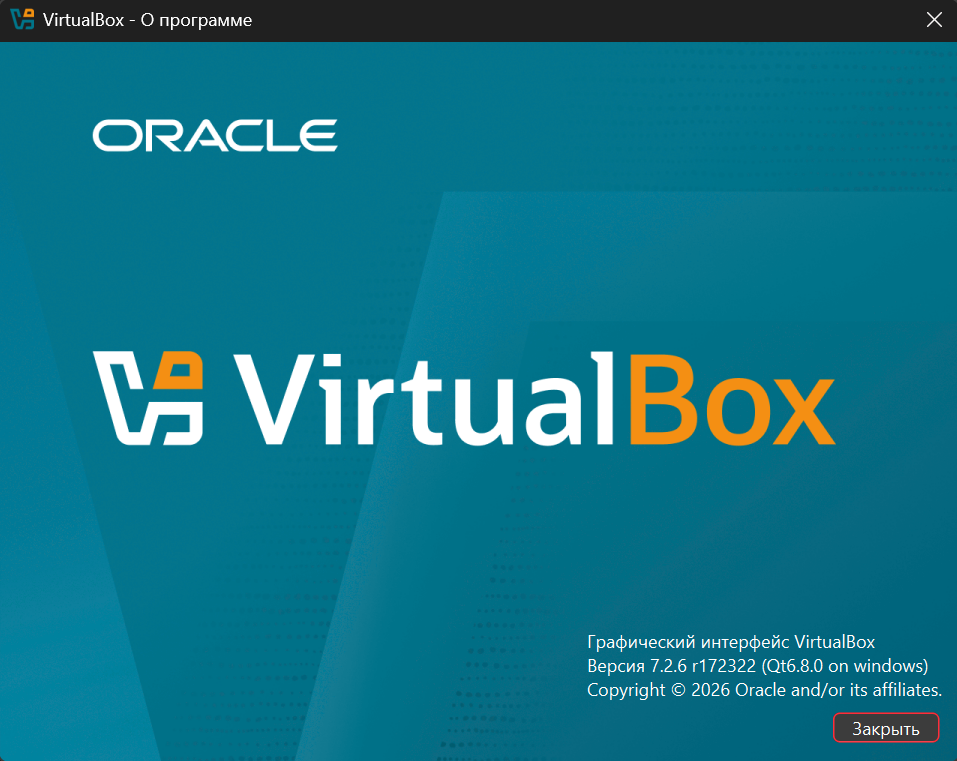

# Ход выполнения работы

## Задание 1. Развёртывание виртуальной машины

На первом этапе лабораторной работы была создана виртуальная машина с использованием гипервизора **Oracle VirtualBox**.
В качестве установочного образа использовался официальный ISO-образ операционной системы **Ubuntu Server 22.04.5 LTS**.

### Создание виртуальной машины

При создании виртуальной машины были указаны следующие параметры:

| Параметр                    | Значение                               |
| --------------------------- | -------------------------------------- |
| Имя виртуальной машины      | `sys-adm-linux`                        |
| Тип операционной системы    | Linux                                  |
| Версия операционной системы | Ubuntu (64-bit)                        |
| Установочный образ          | `ubuntu-22.04.5-live-server-amd64.iso` |

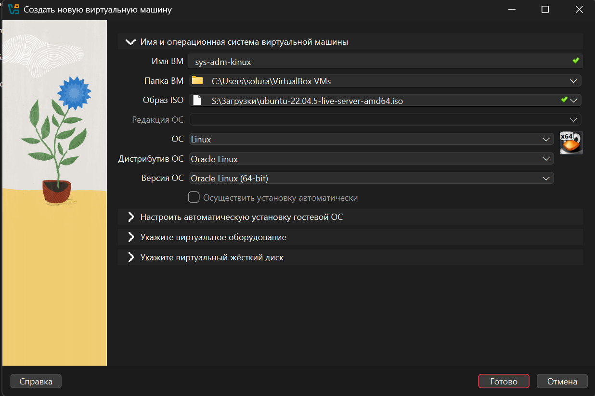

### Аппаратные параметры виртуальной машины

| Параметр                  | Значение                    |
| ------------------------- | --------------------------- |
| Оперативная память        | 2048 MB                     |
| Количество процессоров    | 2                           |
| Тип виртуального диска    | VDI (VirtualBox Disk Image) |
| Размер виртуального диска | 20 GB                       |
| Тип выделения памяти      | Динамический                |

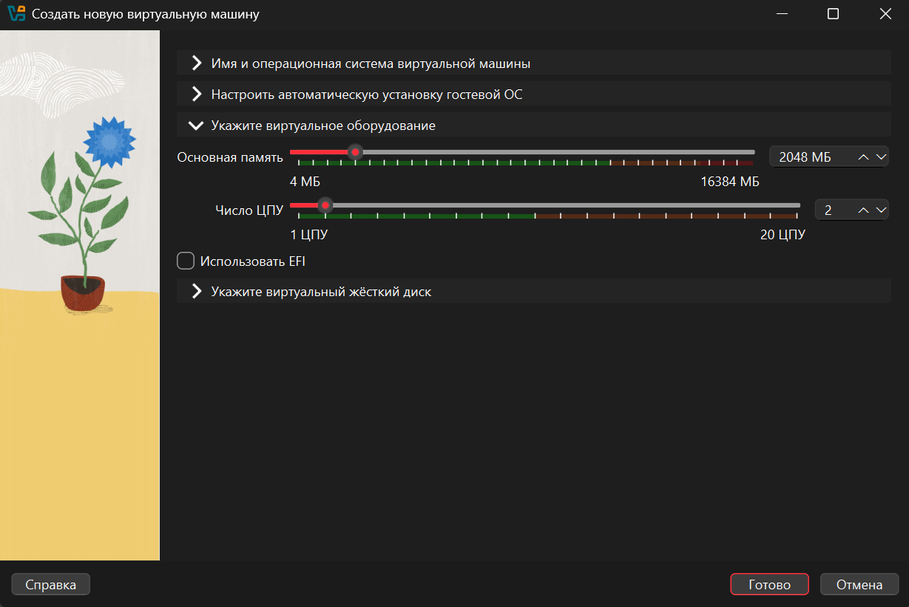
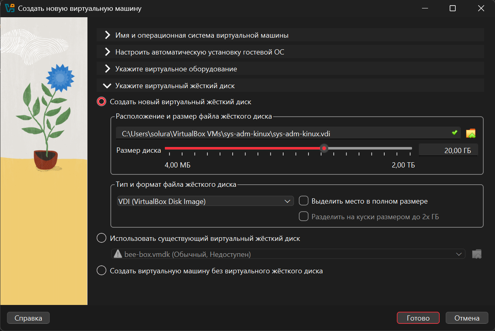

После создания виртуальной машины был подключён установочный ISO-образ **Ubuntu Server**, после чего виртуальная машина была запущена и начался процесс установки операционной системы.

### Установка Ubuntu Server

В процессе установки использовались стандартные параметры системы.
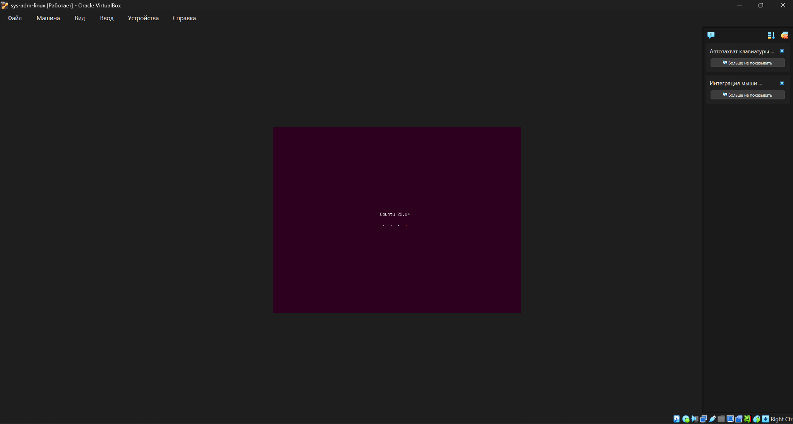

В ходе установки был создан основной пользователь системы и настроена базовая конфигурация сервера.

После завершения установки операционная система была перезагружена и произведён первый вход в систему через консоль виртуальной машины.

В результате была успешно развёрнута виртуальная машина с установленной операционной системой **Ubuntu Server 22.04.5 LTS**.
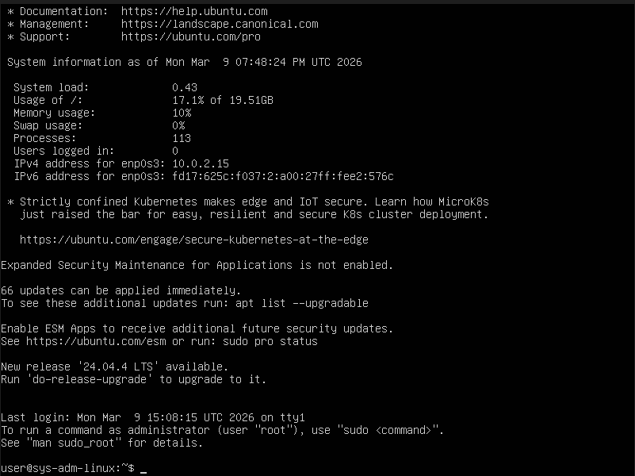

---

## Задание 2. Создание пользователя по фамилии студента

В соответствии с условием лабораторной работы был создан пользователь операционной системы Linux, имя которого совпадает с фамилией студента.

Для создания пользователя была использована команда:

```
sudo adduser nasonov
```

В процессе выполнения команды система автоматически:

* создала пользователя `nasonov`;
* создала одноимённую группу `nasonov`;
* создала домашний каталог пользователя `/home/nasonov`;
* скопировала стандартные конфигурационные файлы из каталога `/etc/skel`.

После создания пользователя была выполнена проверка его существования в системе с помощью команды:

```
id nasonov
```

Команда `id` выводит информацию о пользователе:

* UID — идентификатор пользователя;
* GID — идентификатор основной группы;
* список групп, в которых состоит пользователь.

Результат выполнения команды:

```text
uid=1001(nasonov) gid=1001(nasonov) groups=1001(nasonov),27(sudo)
```

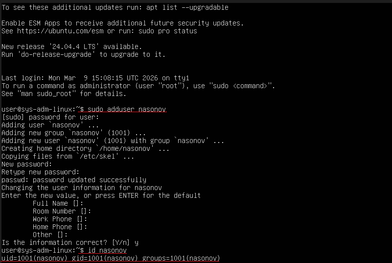

Для проверки текущего пользователя была также выполнена команда:

```
whoami
```

Результат выполнения команды:

```text
nasonov
```

Это подтверждает успешное создание пользователя и возможность работы в системе под данной учетной записью.

---

## Задание 3. Настройка SSH-доступа по ключу

Проверка состояния службы SSH:

``` 
systemctl status ssh
```

В результате служба `ssh.service` должна находиться в состоянии
`active (running)`.  
Для подключения к серверу был определён IP-адрес сетевого интерфейса.

``` 
ip a
```

В выводе команды был определён IPv4-адрес интерфейса `enp0s3`:

``` text
inet 192.168.0.120/24
```

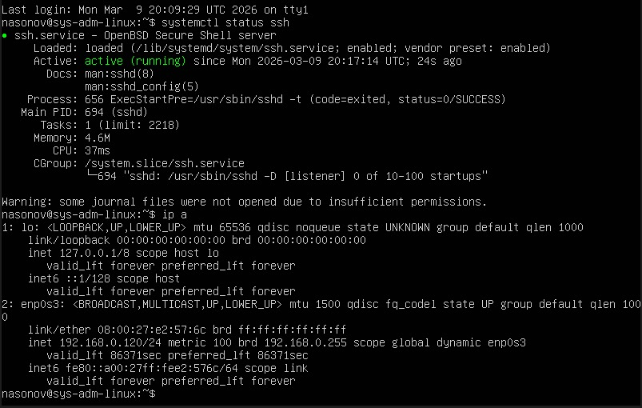


С хостовой машины было выполнено подключение к серверу по SSH.

``` 
ssh nasonov@192.168.0.120
```

При первом подключении система запросила подтверждение добавления
сервера в список доверенных хостов. После подтверждения и ввода пароля
пользователя подключение было успешно выполнено.

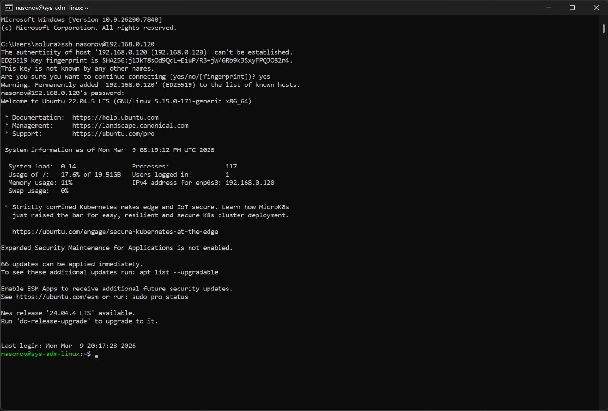

Для настройки ключевой аутентификации была создана пара SSH-ключей.

``` 
ssh-keygen
```

В результате были созданы файлы:

    ~/.ssh/id_ed25519
    ~/.ssh/id_ed25519.pub

где:

-   `id_ed25519` --- приватный ключ;
-   `id_ed25519.pub` --- публичный ключ.

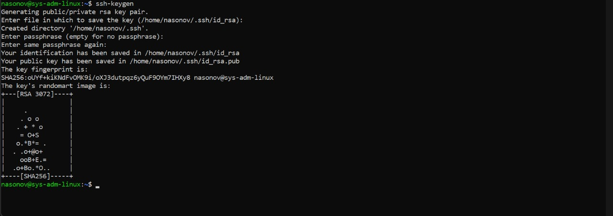

Для передачи публичного ключа на сервер была использована команда:

``` 
ssh-copy-id nasonov@192.168.0.120
```

После выполнения команды публичный ключ был добавлен в файл:

    ~/.ssh/authorized_keys

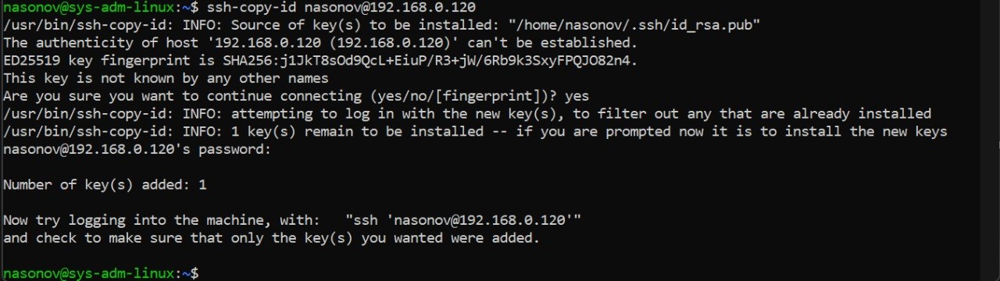

Для обеспечения работы аутентификации по ключу был отредактирован
конфигурационный файл SSH-сервера:

``` 
sudo nano /etc/ssh/sshd_config
```

В файле конфигурации была проверена и включена следующая строка:

``` text
PubkeyAuthentication yes
```

Данный параметр разрешает использование **аутентификации по публичному
ключу** при подключении по SSH.

Также в конфигурации присутствует параметр:

``` text
PasswordAuthentication no
```

Он отключает возможность входа по паролю и разрешает только
**аутентификацию по ключу**, что значительно повышает безопасность
системы.

После изменения конфигурационного файла необходимо перезапустить
SSH-сервер:

``` 
sudo systemctl restart ssh
```

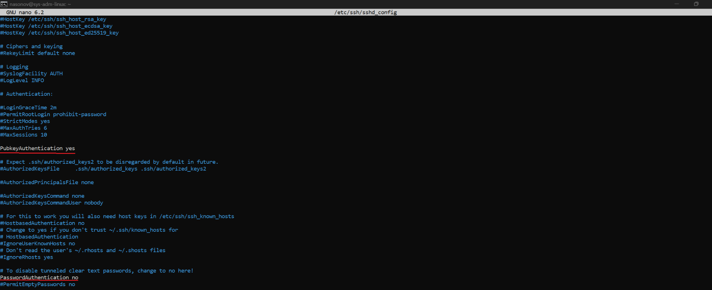


После настройки ключевой аутентификации было выполнено повторное
подключение к серверу.

``` 
ssh nasonov@192.168.0.120
```

Подключение было выполнено без запроса пароля, что подтверждает
корректную настройку SSH-аутентификации по ключу.

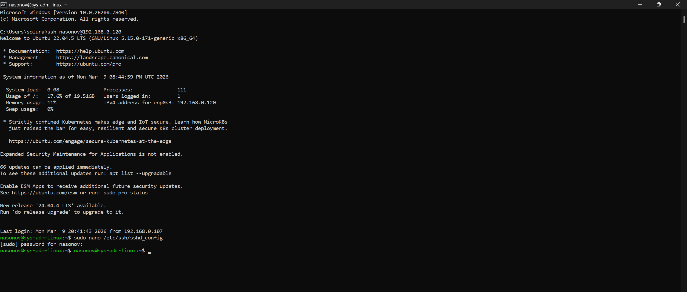

---

## Задание 4. Конфигурация виртуальной машины

Для получения информации о процессоре используется команда:

``` 
lscpu
```

Команда выводит архитектуру процессора, модель CPU, количество ядер и
другую системную информацию.  
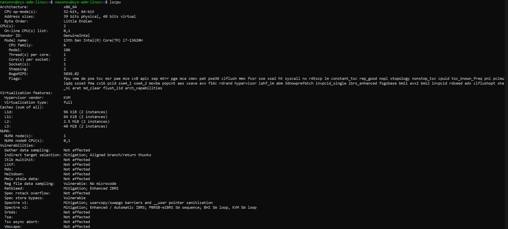

Для просмотра информации об оперативной памяти используется команда:

``` 
free -h
```

Команда показывает общий объём оперативной памяти, а также используемую
и свободную память.
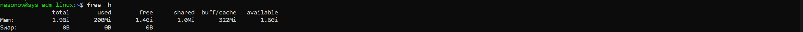

Для просмотра информации о подключённых дисках и разделах используется
команда:

``` 
lsblk
```

Команда отображает список устройств хранения данных и их структуру.

Дополнительно используется команда:

```
df -h
```

Она показывает использование дискового пространства файловых систем.
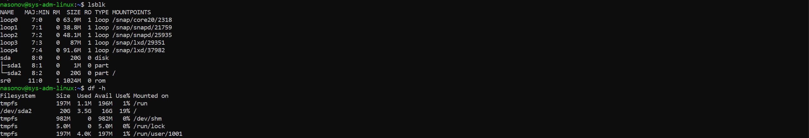

Для получения информации о сетевых интерфейсах используется команда:

``` 
ip a
```

Команда выводит список сетевых интерфейсов системы и их IP‑адреса.
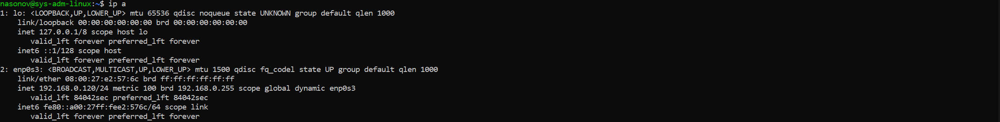
---


# Задание 5. Раздел и монтирование /disk

Просмотр существующих дисков и разделов:

```
lsblk
```
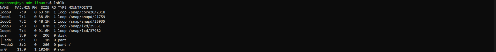
Создание нового раздела:

```
sudo fdisk /dev/sda
```

В процессе работы создан новый раздел **/dev/sda3**.
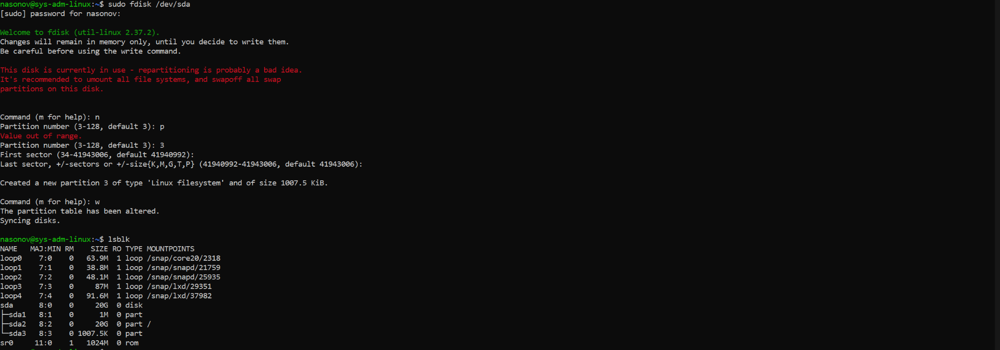

Для нового раздела была создана файловая система **ext4**:

```
sudo mkfs.ext4 /dev/sda3
```

Создаём каталог для монтирования раздела:

```
sudo mkdir /disk
```

Монтируем раздел в каталог `/disk`:

```
sudo mount /dev/sda3 /disk
```

Проверка:

```
mount | grep disk
```
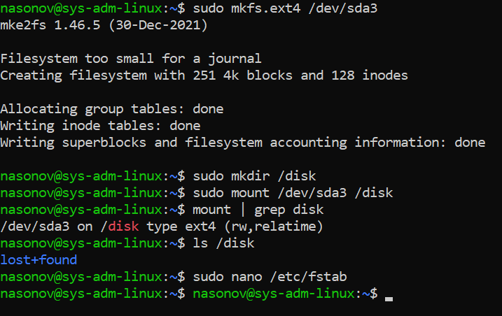

Настройка автомонтирования. Открываем файл:

```
sudo nano /etc/fstab
```

Добавляем строку:

```
/dev/sda3 /disk ext4 defaults 0 2
```
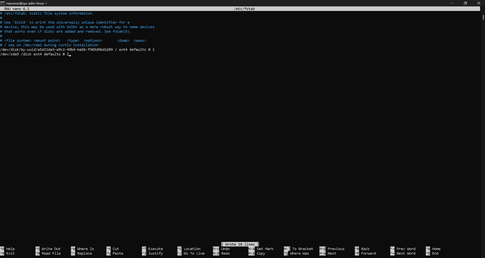

После этого выполняем проверку:

```
sudo mount -a
```

Назначаем владельца каталога:

```
sudo chown nasonov:nasonov /disk
```
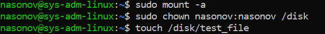
Проверка доступа:

```
touch /disk/test_file
ls /disk
```
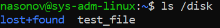  
В каталоге успешно создан файл **test_file**, что подтверждает корректную настройку прав доступа.

---

# Выводы

В ходе выполнения лабораторной работы были освоены базовые навыки работы с операционной системой Linux в среде виртуализации. Была создана и настроена виртуальная машина с установленной системой Ubuntu Server.

В процессе работы был создан пользователь системы, настроен удалённый доступ по SSH с использованием ключевой аутентификации, что позволило повысить безопасность подключения к серверу.

Также была изучена конфигурация виртуальной машины, включая параметры процессора, оперативной памяти, дисков и сетевых интерфейсов. Дополнительно была выполнена работа с дисковой подсистемой: создан новый раздел, выполнено его форматирование, монтирование в каталог `/disk`, а также настроено автоматическое подключение через файл `/etc/fstab`.

Основной сложностью при выполнении работы стала разметка диска с использованием утилиты `fdisk`, так как требовалось аккуратно работать с уже используемым диском, чтобы не повредить существующие разделы системы.

В результате были получены практические навыки администрирования Linux, работы с пользователями, SSH-доступом и файловыми системами.