# Лабораторная работа №2

## RAID, LVM, NFS, cron, файрвол и сетевые сервисы

**Дисциплина:** Системное администрирование Linux  
**Студент:** Михаил Насонов  
**Группа:** *6413-10.05.03D*  
**Дата выполнения:** 06.04.2026

---

# Цель работы

Освоить работу с RAID-массивами и менеджером логических томов (LVM).
Научиться настраивать сетевые сервисы (SSH, NFS, Samba, OpenVPN), управлять доступом с помощью файрвола, выполнять мониторинг сетевой активности и автоматизировать задачи с помощью cron.

---

# Среда выполнения

Для выполнения лабораторной работы использовался гипервизор **Oracle VirtualBox**, в котором была развёрнута виртуальная машина с операционной системой **Ubuntu Server**.

| Компонент               | Значение                    |
| ----------------------- | --------------------------- |
| Гипервизор              | Oracle VirtualBox           |
| Версия VirtualBox       | 7.2.6                       |
| Операционная система ВМ | Ubuntu Server               |
| Версия Ubuntu           | 22.04.5 LTS                 |
| Архитектура             | amd64 (64-bit)              |
| Количество дисков       | 4 (1 основной + 3 для RAID) |
| Размер доп. дисков      | 10 GB каждый                |

---

# Ход выполнения работы
# Часть 1

## Задание 1. Развёртывание виртуальной машины и подключение дополнительных дисков

В рамках лабораторной работы использовалась виртуальная машина, созданная ранее в лабораторной работе №1 на базе операционной системы **Ubuntu Server 22.04.5 LTS**.

Дополнительно к виртуальной машине были подключены три виртуальных жёстких диска, необходимых для последующей настройки RAID-массива 5-го уровня.

### Подключение дополнительных дисков

Подключение дисков выполнялось в настройках виртуальной машины в разделе **«Носители»**.
Диски были добавлены к контроллеру **SATA (AHCI)**.

Параметры добавленных дисков:

| Параметр          | Значение     |
| ----------------- | ------------ |
| Тип диска         | VDI          |
| Формат хранения   | Динамический |
| Количество дисков | 3            |
| Размер каждого    | 10 GB        |

### Конфигурация дисков

После подключения структура дисков виртуальной машины имеет следующий вид:

| Устройство | Назначение     | Размер |
| ---------- | -------------- | ------ |
| `sda`      | Системный диск | 20 GB  |
| `sdb`      | Дополнительный | 10 GB  |
| `sdc`      | Дополнительный | 10 GB  |
| `sdd`      | Дополнительный | 10 GB  |


### Проверка подключения

Для проверки корректности подключения дисков была использована команда:

```
lsblk
```

В результате выполнения команды были отображены все подключенные устройства, включая три дополнительных диска (`sdb`, `sdc`, `sdd`).

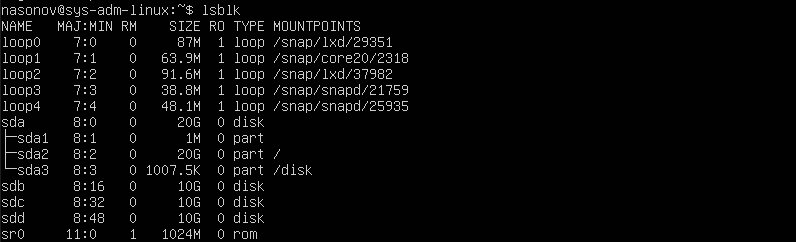

## Задание 2. Настройка SSH-сервера

На данном этапе был настроен SSH-сервер для удалённого доступа к виртуальной машине.
Доступ осуществлялся по ключу для пользователя с правами администратора. Парольная аутентификация была отключена.

### Установка SSH-сервера

Для установки SSH-сервера была выполнена команда:

```
sudo apt update
sudo apt install openssh-server -y
```

### Проверка работы сервиса

После установки была выполнена проверка состояния службы:

```
systemctl status ssh
```

Сервис успешно запущен и находится в состоянии `active (running)`.


### Генерация SSH-ключа

На стороне клиента (Windows) был сгенерирован SSH-ключ:

```
ssh-keygen
```

В результате были созданы файлы:

* приватный ключ: `id_ed25519`
* публичный ключ: `id_ed25519.pub`


### Копирование ключа на сервер

Публичный ключ был добавлен на сервер с использованием команды:

```id="f7k2wq"
type C:\Users\solura\.ssh\id_ed25519.pub | ssh nasonov@192.168.0.120 "mkdir -p ~/.ssh && cat >> ~/.ssh/authorized_keys"
```


### Настройка прав доступа

После добавления ключа были установлены необходимые права доступа:

```id="w9qk3m"
chmod 700 ~/.ssh
chmod 600 ~/.ssh/authorized_keys
```


### Настройка конфигурации SSH

Был отредактирован файл конфигурации SSH-сервера:

```
sudo nano /etc/ssh/sshd_config
```

В файле были установлены следующие параметры:

```
PasswordAuthentication no
PermitRootLogin no
PubkeyAuthentication yes
```

### Применение настроек

После внесения изменений служба SSH была перезапущена:

```
sudo systemctl restart ssh
```

### Проверка подключения

Подключение к серверу выполняется по ключу:

```
ssh nasonov@192.168.0.120
```

Подключение выполняется успешно без запроса пароля.
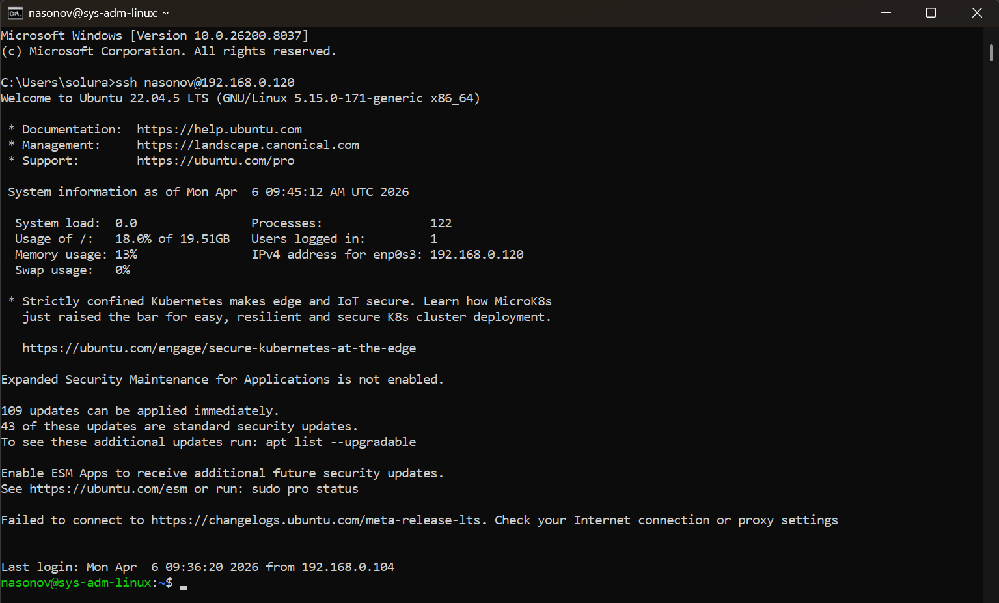

## Задание 3. Настройка сетевого интерфейса

На данном этапе была выполнена настройка сетевого интерфейса виртуальной машины с использованием утилиты **netplan**.

В качестве сетевого подключения использовался режим **сетевого моста (Bridge Adapter)**, что позволило виртуальной машине получить IP-адрес в одной сети с хостовой системой.

### Проверка сетевых интерфейсов

Для просмотра доступных сетевых интерфейсов была выполнена команда:

```
ip a
```

В результате был обнаружен интерфейс `enp0s3`.
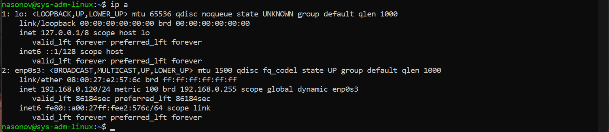

### Настройка netplan

Для конфигурации сети был отредактирован файл:

```
sudo nano /etc/netplan/50-cloud-init.yaml
```

В файл была добавлена следующая конфигурация:

```yaml
network:
  version: 2
  ethernets:
    enp0s3:
      dhcp4: no
      addresses:
        - 192.168.0.150/24
      routes:
        - to: default
          via: 192.168.0.1
      nameservers:
        addresses:
          - 8.8.8.8
          - 1.1.1.1
```

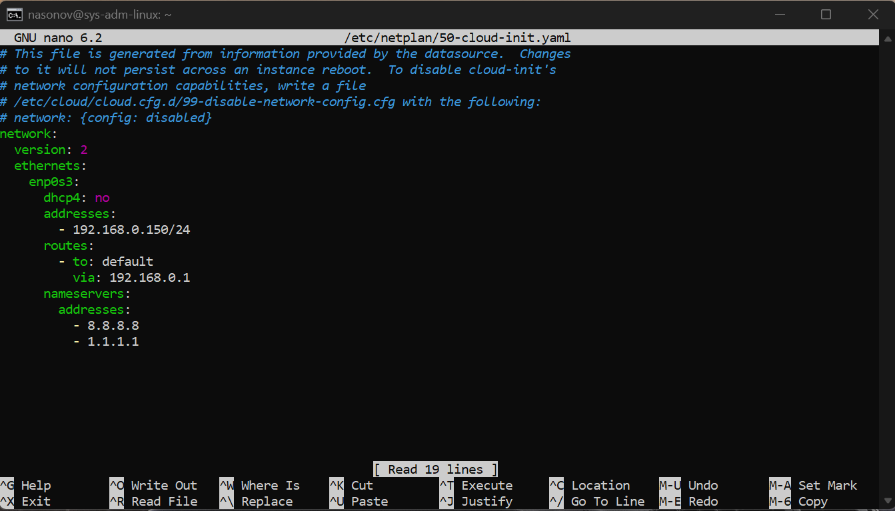
После внесения изменений конфигурация была применена:

```
sudo netplan apply
```

### Отключение автоматической настройки сети (cloud-init)

В процессе настройки было выявлено, что после перезагрузки виртуальной машины конфигурация сети сбрасывается.
Причиной этого является утилита **cloud-init**, которая автоматически генерирует сетевые настройки.

Для предотвращения перезаписи конфигурации было выполнено отключение сетевой настройки cloud-init.

Для этого был создан и отредактирован файл:

```
sudo nano /etc/cloud/cloud.cfg.d/99-disable-network-config.cfg
```

В файл была добавлена следующая конфигурация:

```yaml
network: {config: disabled}
```

После этого изменения конфигурации сети через netplan сохраняются после перезагрузки системы.


### Проверка настроек сети

После применения настроек были выполнены команды:

```
ip a
ip r
```

В результате виртуальная машина получила статический IP-адрес:

```
192.168.0.150
```
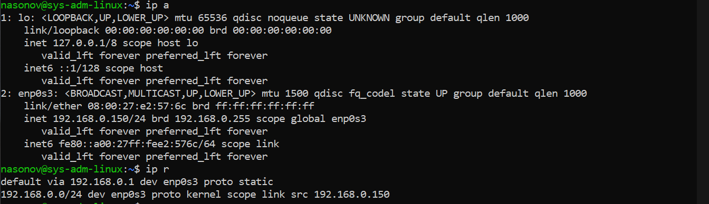

### Проверка открытых портов

Для проверки активных сетевых соединений и открытых портов была использована команда:

```
ss -tuln
```

Команда показала, что порт `22` (SSH) находится в состоянии прослушивания.


## Задание 4. Анализ дискового пространства

На данном этапе была изучена конфигурация дискового пространства виртуальной машины.

### Просмотр подключённых дисков и разделов

Для анализа дисков была использована команда:

```
lsblk -o NAME,SIZE,TYPE,FSTYPE,MOUNTPOINT
```

В результате были выявлены следующие устройства:

* основной диск `sda` объёмом 20 GB, содержащий:

  * раздел `sda2`, смонтированный в корневую директорию `/`
  * раздел `sda3`, смонтированный в `/disk`
  * дополнительные диски `sdb`, `sdc`, `sdd` объёмом по 10 GB, не содержащие разделов и файловых систем  
  
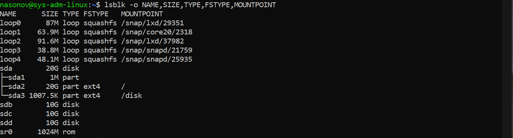

### Подробная информация о дисках

Для получения детальной информации была выполнена команда:

```id="9kzq4m"
sudo fdisk -l
```

Команда подтвердила наличие одного системного диска и трёх дополнительных дисков без разметки.


## Задание 5. Создание RAID-массива уровня 5

На данном этапе свободные неразмеченные диски виртуальной машины были объединены в RAID-массив 5-го уровня.

### Установка утилиты mdadm

Для работы с RAID была установлена утилита:

```id="m8k2fa"
sudo apt update
sudo apt install mdadm -y
```

### Создание RAID-массива

RAID-массив был создан из трёх дисков (`sdb`, `sdc`, `sdd`) с использованием следующей команды:

```id="x2v9rt"
sudo mdadm --create --verbose /dev/md0 \
--level=5 \
--raid-devices=3 \
/dev/sdb /dev/sdc /dev/sdd
```
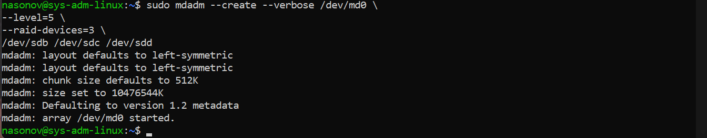

### Проверка состояния массива

Для проверки состояния RAID-массива была использована команда:

```
cat /proc/mdstat
```

В результате было подтверждено, что массив `md0` успешно создан и находится в активном состоянии.


### Детальная информация о массиве

Дополнительно была получена подробная информация о RAID-массиве:

```
sudo mdadm --detail /dev/md0
```

Команда отобразила параметры массива, включая уровень RAID, количество устройств и состояние дисков.

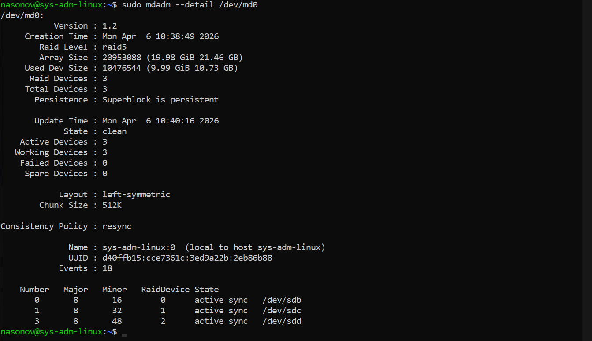

## Задание 6. Настройка LVM и монтирование

На данном этапе на основе RAID-массива был настроен менеджер логических томов (LVM).

### Создание физического тома (PV)

Для создания физического тома была выполнена команда:

```
sudo pvcreate /dev/md0
```

Проверка:

```
sudo pvs
```
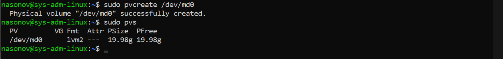

### Создание группы томов (VG)

Группа томов была создана с именем по фамилии студента:

```
sudo vgcreate nasonov /dev/md0
```

Проверка:

```
sudo vgs
```


### Создание логического тома (LV)

Был создан логический том `lv0`, занимающий всё доступное пространство:

```
sudo lvcreate -n lv0 -l 100%FREE nasonov
```

Проверка:

```
sudo lvs
```


### Создание файловой системы

На логическом томе была создана файловая система:

```
sudo mkfs.ext4 /dev/nasonov/lv0
```
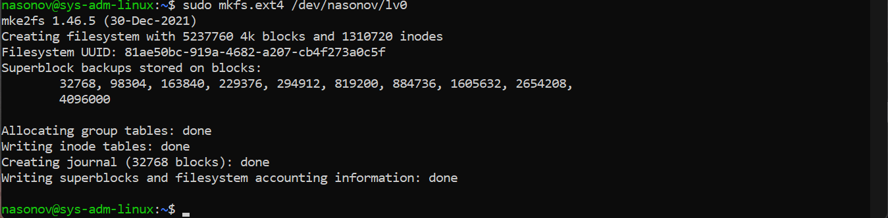

### Монтирование

Была создана точка монтирования:

```
sudo mkdir -p /raid/0
```

Выполнено монтирование:

```
sudo mount /dev/nasonov/lv0 /raid/0
```

Проверка:

```
df -h
```
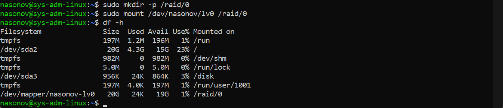

### Настройка автоматического монтирования

Для постоянного монтирования был получен UUID логического тома:

```
sudo blkid /dev/nasonov/lv0
```

В файл `/etc/fstab` была добавлена строка:

```
UUID=81ae50bc-919a-4682-a207-cb4f273a0c5f /raid/0 ext4 defaults 0 2
```
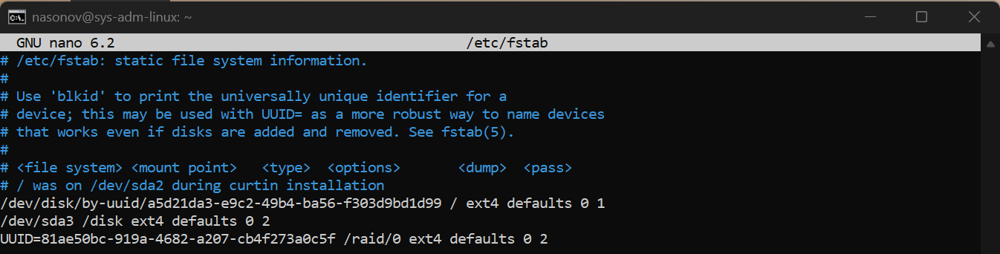
После этого была выполнена проверка:

```
sudo mount -a
```

Ошибок при выполнении команды не возникло, что подтверждает корректность настроек.
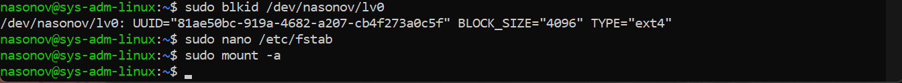

## Задание 7. Расширение RAID и LVM

На данном этапе был добавлен новый диск в виртуальную машину и выполнено расширение RAID-массива и логического тома.

### Добавление диска

Средствами гипервизора был добавлен новый диск объёмом 10 GB.
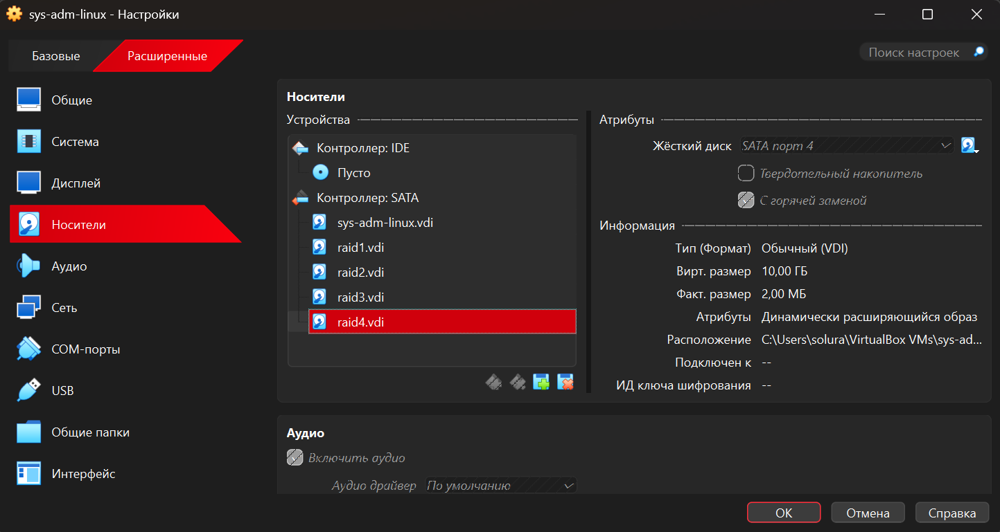
После запуска системы диск был обнаружен:

```
lsblk
```
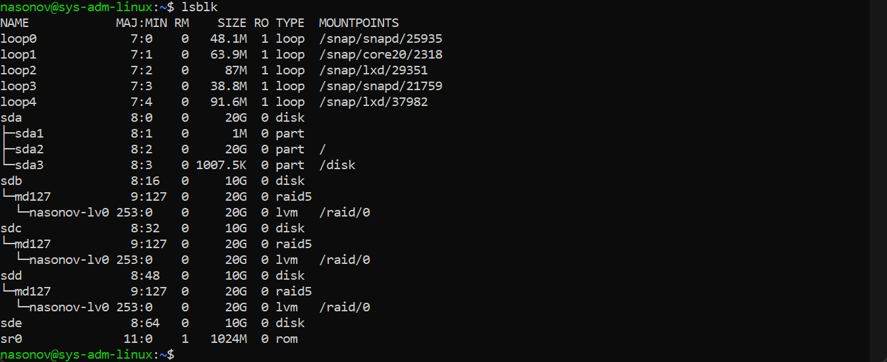

### Добавление диска в RAID

После перезагрузки системы RAID-массив был автоматически собран под именем `md127` вместо исходного `md0`.

Новый диск был добавлен в RAID-массив:

```
sudo mdadm --add /dev/md127 /dev/sde
```

После этого массив был расширен:

```
sudo mdadm --grow /dev/md127 --raid-devices=4
```


### Проверка состояния RAID

```
cat /proc/mdstat
```

В процессе выполнения наблюдалось состояние перестроения массива (reshape).


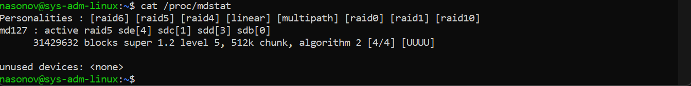

### Расширение LVM

После завершения перестроения RAID были выполнены команды:

```
sudo pvresize /dev/md127
sudo lvextend -l +100%FREE /dev/nasonov/lv0
```


### Расширение файловой системы
После увеличения логического тома было выполнено расширение файловой системы:
```
sudo resize2fs /dev/nasonov/lv0
```


### Проверка результата

```
df -h
```

В результате было установлено, что размер логического тома `lv0`, смонтированного в каталог `/raid/0`, увеличился до ~30 GB.
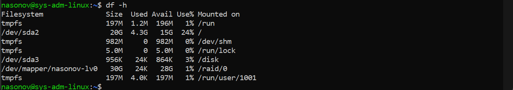

## Задание 8. *Пропущено*

Данное задание в рамках выполнения лабораторной работы не выполнялось.

## Задание 9. Настройка доступа по NFS

На данном этапе был настроен доступ по протоколу NFS к каталогу `backup`, расположенному на RAID-массиве.

### Установка NFS-сервера

Для установки сервера была выполнена команда:

```
sudo apt install nfs-kernel-server -y
```

### Создание каталога

Был создан каталог для хранения резервных копий:

```
sudo mkdir -p /raid/0/backup
sudo chmod 777 /raid/0/backup
```

### Настройка экспорта

В файл `/etc/exports` была добавлена строка:

```
/raid/0/backup 192.168.0.0/24(rw,sync,no_subtree_check)
```


### Применение настроек

```
sudo exportfs -a
sudo systemctl restart nfs-kernel-server
```

### Проверка

Для проверки доступных ресурсов была выполнена команда:

```
showmount -e
```

В результате был отображён экспортируемый каталог `/raid/0/backup`.


## Задание 10. Настройка резервного копирования

На данном этапе было настроено автоматическое резервное копирование содержимого домашнего каталога пользователя в каталог `backup` с использованием планировщика заданий cron.

### Использование rsync

Для копирования данных была использована утилита `rsync`, обеспечивающая эффективную синхронизацию файлов:

```
rsync -av /home/nasonov/ /raid/0/backup/
```
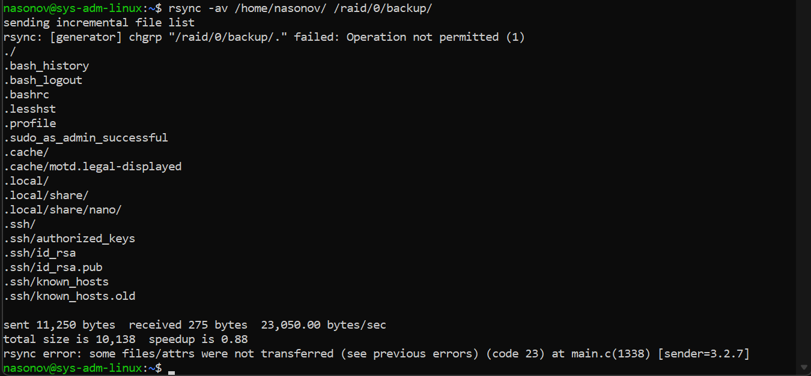

### Настройка cron

Для автоматического выполнения копирования был настроен планировщик cron:

```
crontab -e
```

В файл была добавлена строка:

```
*/2 * * * * rsync -a /home/nasonov/ /raid/0/backup/
```

Данная запись обеспечивает выполнение резервного копирования каждые 2 минуты.
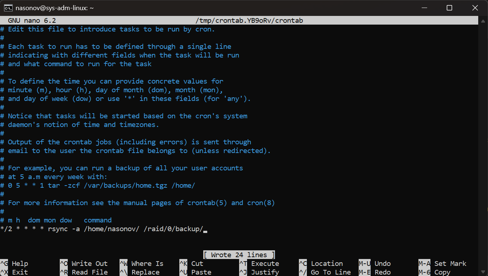

### Проверка работы

Для проверки работы был создан тестовый файл в домашнем каталоге пользователя, после чего было подтверждено его появление в каталоге `/raid/0/backup`.

```
ls /raid/0/backup
```


# Часть 2

## Задание 11. Настройка правил iptables

На данном этапе были настроены правила межсетевого экрана с использованием утилиты `iptables`.

### Блокировка SSH

Была выполнена блокировка входящих соединений на порт 22:

```
sudo iptables -A INPUT -p tcp --dport 22 -j DROP
```

### Блокировка трафика с определённого IP-адреса

Был заблокирован трафик с IP-адреса хоста:

```
sudo iptables -A INPUT -s 192.168.0.100 -j DROP
```

### Блокировка ICMP (ping)

```
sudo iptables -A INPUT -p icmp -j DROP
```

### Проверка правил

```
sudo iptables -L -n -v
```

В результате были отображены добавленные правила.
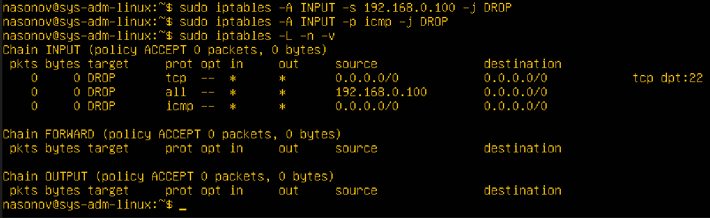
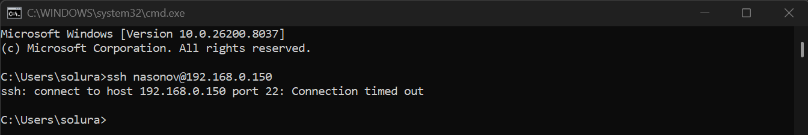

## Задание 12. Удаление правил iptables

Для удаления ранее добавленных правил была выполнена команда:

```
sudo iptables -F
```
### Проверка правил
```
sudo iptables -L
```
Список правил оказался пустым.
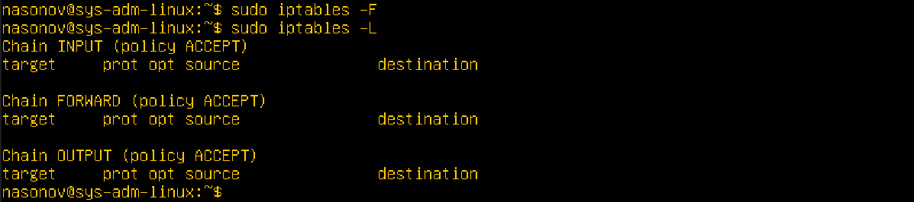
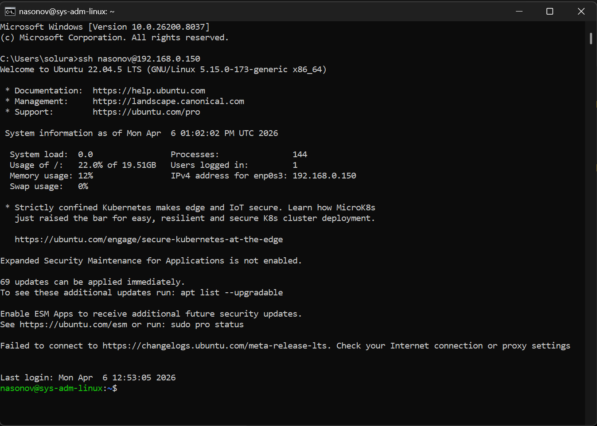

## Задание 13. Настройка брандмауэра UFW

На данном этапе был включён брандмауэр UFW и настроены правила фильтрации трафика.

### Включение UFW

Включение брандмауэра:

```
sudo ufw enable
```

### Блокировка SSH

```
sudo ufw deny 22
```

### Блокировка трафика с IP-адреса

```
sudo ufw deny from 192.168.0.100
```

### Блокировка ICMP (ping)

Для блокировки ICMP был отредактирован файл:

```
sudo nano /etc/ufw/before.rules
```

В файл было добавлено правило:

```
-A ufw-before-input -p icmp --icmp-type echo-request -j DROP
```
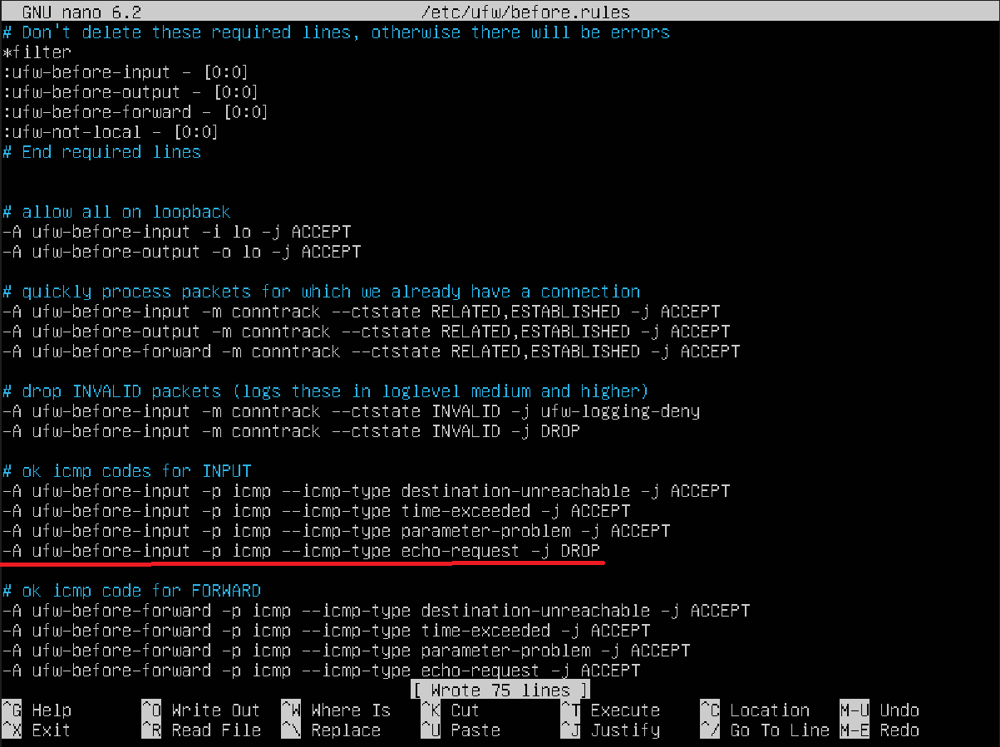
После этого конфигурация была применена:

```
sudo ufw reload
```

### Проверка работы правил

После применения правил брандмауэра была выполнена проверка их состояния:

```
sudo ufw status numbered
```

В результате были отображены правила блокировки входящих соединений.

Попытка подключения по SSH была заблокирована, что подтверждает корректность настроенных правил.

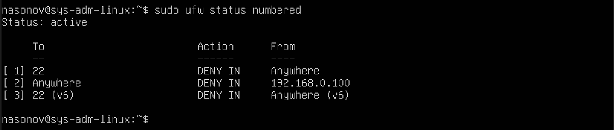
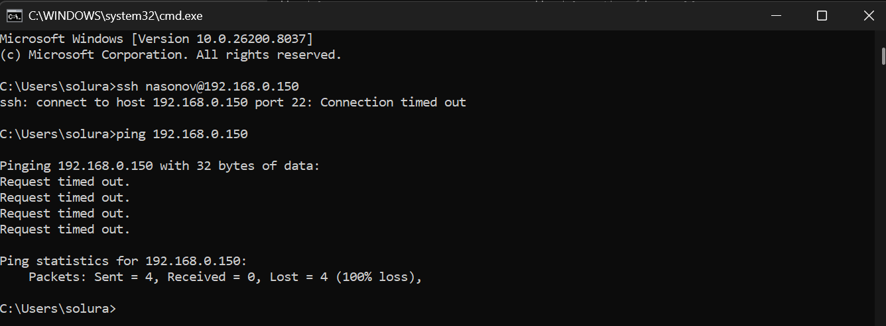

## Задание 14. Мониторинг и диагностика сети

На данном этапе были использованы утилиты `ss` и `nc` для анализа сетевых подключений и проверки доступности сервисов.

### Просмотр открытых портов

Для просмотра активных сетевых соединений была выполнена команда:

```
ss -tuln
```

В результате было установлено, что порт `22` (SSH) находится в состоянии прослушивания.
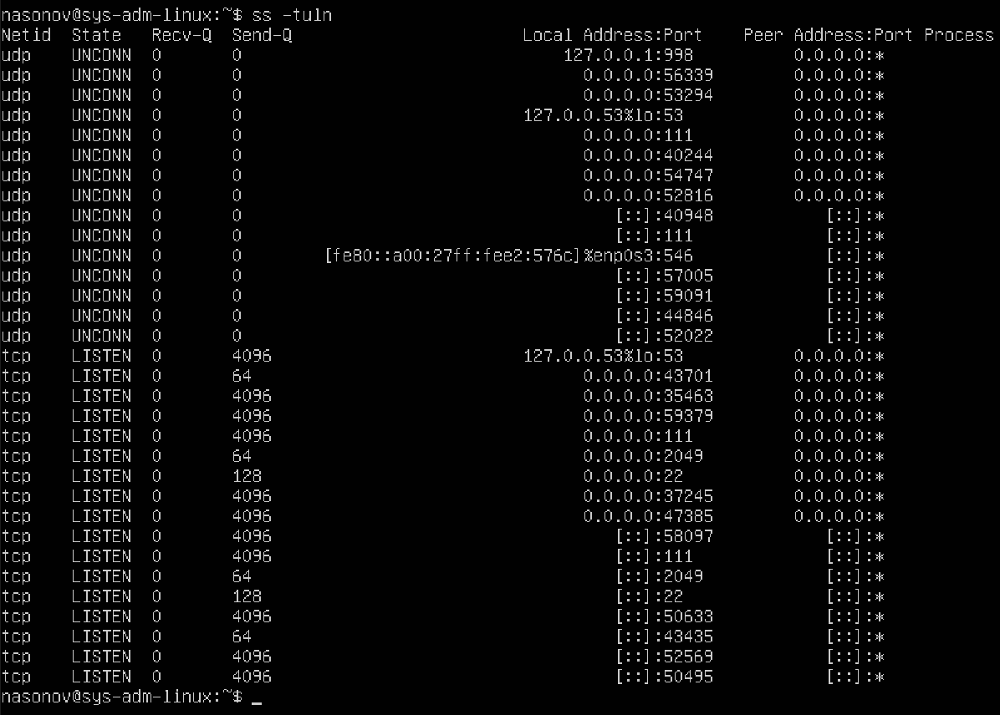

### Проверка доступности сервиса

Для проверки доступности SSH-сервера была использована утилита `nc`:

```
nc -zv 127.0.0.1 22
```

В результате было получено сообщение об успешном подключении, что подтверждает доступность сервиса.


## Задание 15. Анализ сетевого трафика с использованием tcpdump

На данном этапе был выполнен анализ сетевого трафика с использованием утилиты `tcpdump`.

### Установка tcpdump

```
sudo apt install tcpdump -y
```

### Фильтрация по порту

Для анализа трафика на порту 22 (SSH) была выполнена команда:

```
sudo tcpdump -i enp0s3 port 22
```
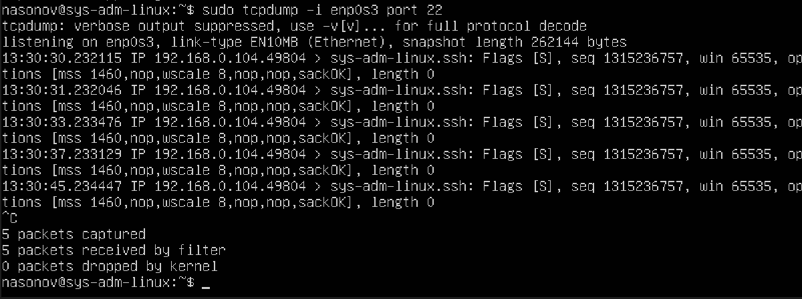

### Фильтрация по ICMP

Для анализа ICMP-трафика (ping) была использована команда:

```
sudo tcpdump -i enp0s3 icmp
```
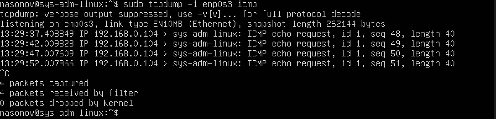

### Фильтрация по IP-адресу

Для анализа трафика с определённым узлом была выполнена команда:

```
sudo tcpdump -i enp0s3 host 192.168.0.1
```
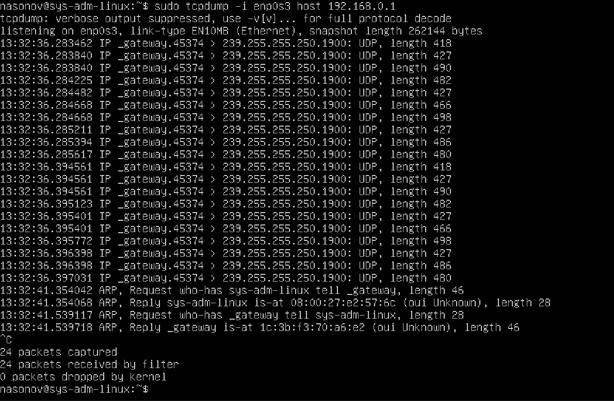

### Запись трафика в файл

Для сохранения трафика в файл была выполнена команда:

```
sudo tcpdump -i enp0s3 -w capture.pcap
```

### Просмотр сохранённого трафика

```
sudo tcpdump -r capture.pcap
```
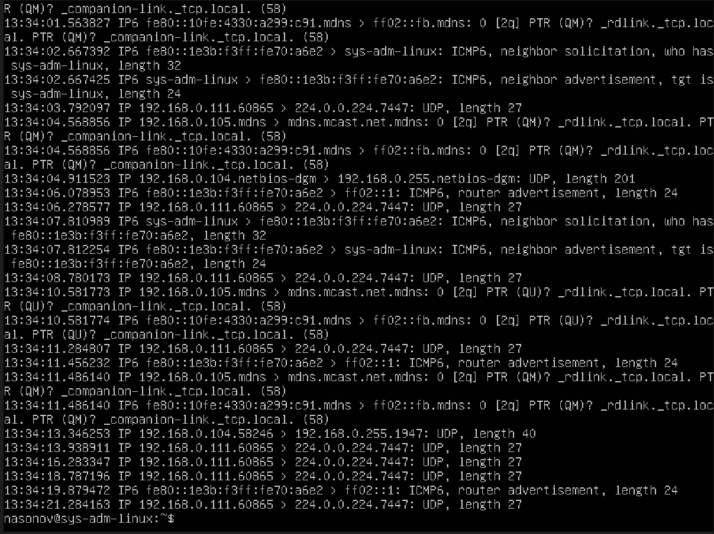

## Задание 16. Мониторинг трафика с использованием iptraf-ng

На данном этапе был выполнен мониторинг сетевого трафика в реальном времени с использованием утилиты `iptraf-ng`.

### Установка iptraf-ng

```
sudo apt install iptraf-ng -y
```

### Запуск программы

```
sudo iptraf-ng
```
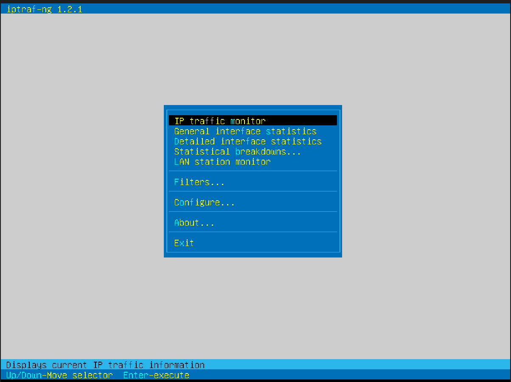
### Мониторинг трафика

В интерфейсе программы был выбран режим:

```
IP traffic monitor
```

После этого был выбран сетевой интерфейс `enp0s3`.

В результате на экране отображалась информация о текущем сетевом трафике, включая IP-адреса, порты и количество переданных пакетов.

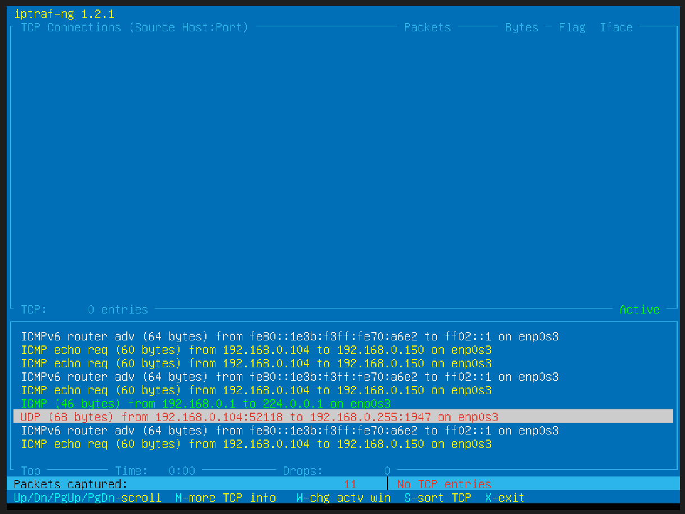

## Задание 17. Настройка дополнительного сетевого интерфейса

На данном этапе был настроен дополнительный сетевой интерфейс с использованием утилиты netplan.

### Добавление сетевого адаптера

В настройках виртуальной машины был добавлен второй сетевой адаптер в режиме Host-Only Adapter.
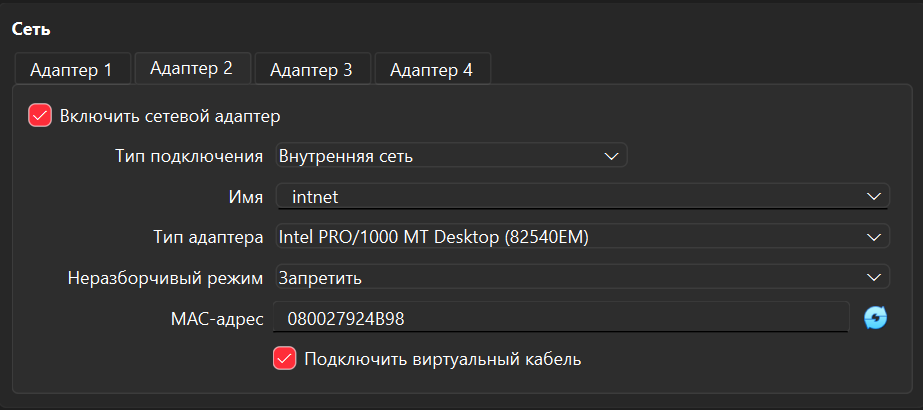
### Проверка интерфейсов

После запуска системы была выполнена команда:

```
ip a
```

В результате был обнаружен новый сетевой интерфейс `enp0s8`.
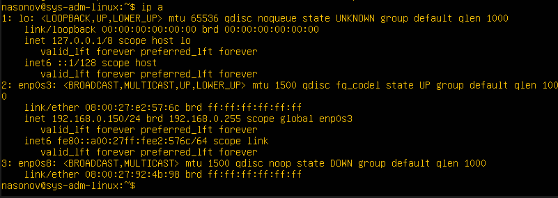

### Настройка netplan

Для настройки интерфейса был отредактирован файл:

```
sudo nano /etc/netplan/50-cloud-init.yaml
```

В файл была добавлена следующая конфигурация:

```
enp0s8:
  dhcp4: no
  addresses:
    - 172.23.0.7/24
```
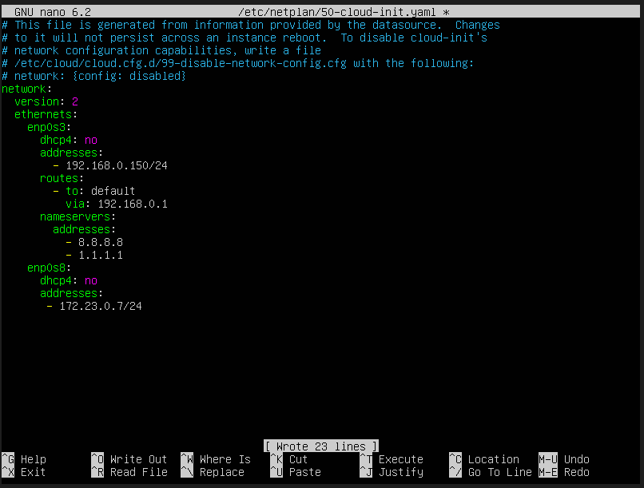

### Применение настроек

```
sudo netplan apply
```

### Проверка

```
ip a
```

В результате интерфейсу `enp0s8` был назначен IP-адрес:

```
172.23.0.7
```
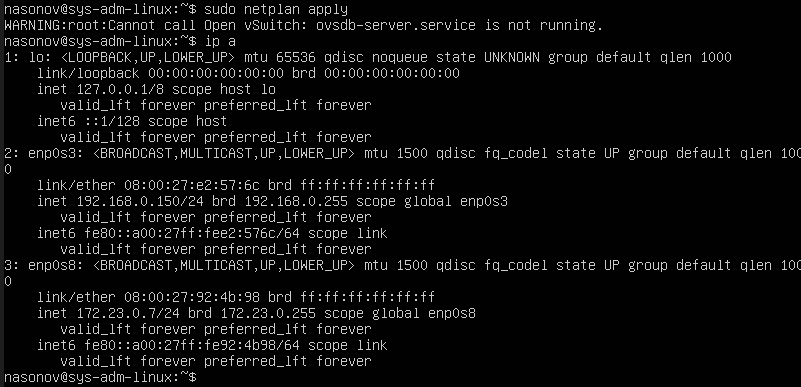

## Задание 18. Настройка портов и проверка доступности

На данном этапе были открыты порты 139 и 445 с использованием брандмауэра UFW.

### Открытие портов

```
sudo ufw allow 139
sudo ufw allow 445
```


### Проверка правил

```
sudo ufw status numbered
```

В результате были отображены разрешающие правила для портов 139 и 445.
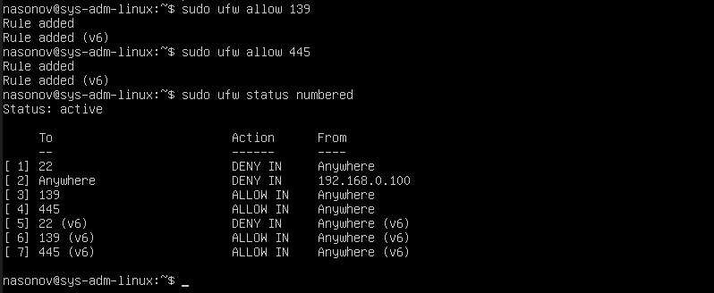

### Проверка доступности портов

Проверка доступности портов была выполнена с использованием утилиты `nc` с указанием тайм-аута:

```
nc -zv -w 2 172.23.0.7 139
nc -zv -w 2 172.23.0.7 445
```

В результате было получено сообщение `Connection refused`, что подтверждает доступность портов при отсутствии активного сервиса.


## Задание 19. Настройка OpenVPN-сервера

На данном этапе был установлен и настроен VPN-сервер с использованием OpenVPN с адресным пространством 10.8.0.0/24.

---

### Установка OpenVPN

```
sudo apt update
sudo apt install openvpn easy-rsa -y
```

### Подготовка инфраструктуры сертификатов

```
make-cadir ~/openvpn-ca
cd ~/openvpn-ca
```

Инициализация PKI:

```
./easyrsa init-pki
./easyrsa build-ca
```

### Генерация сертификатов сервера

```
./easyrsa gen-req server nopass
./easyrsa sign-req server server
```

### Генерация сертификата клиента

```
./easyrsa gen-req client1 nopass
./easyrsa sign-req client client1
```

### Генерация параметров Диффи-Хеллмана

```
./easyrsa gen-dh
```

### Копирование файлов конфигурации

```
sudo cp pki/ca.crt /etc/openvpn/
sudo cp pki/private/server.key /etc/openvpn/
sudo cp pki/issued/server.crt /etc/openvpn/
sudo cp pki/dh.pem /etc/openvpn/
```

### Настройка сервера

Создан конфигурационный файл:

```
sudo nano /etc/openvpn/server.conf
```

Содержимое:

```
port 1194
proto udp
dev tun

ca /etc/openvpn/ca.crt
cert /etc/openvpn/server.crt
key /etc/openvpn/server.key
dh /etc/openvpn/dh.pem

server 10.8.0.0 255.255.255.0
topology subnet

persist-key
persist-tun
keepalive 10 120

data-ciphers AES-256-GCM:AES-128-GCM:AES-256-CBC
auth SHA256

user nobody
group nogroup

status /var/log/openvpn-status.log
verb 3
```
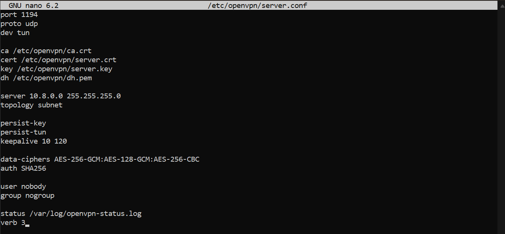

### Включение маршрутизации

```
sudo nano /etc/sysctl.conf
```

Раскомментирована строка:

```
net.ipv4.ip_forward=1
```
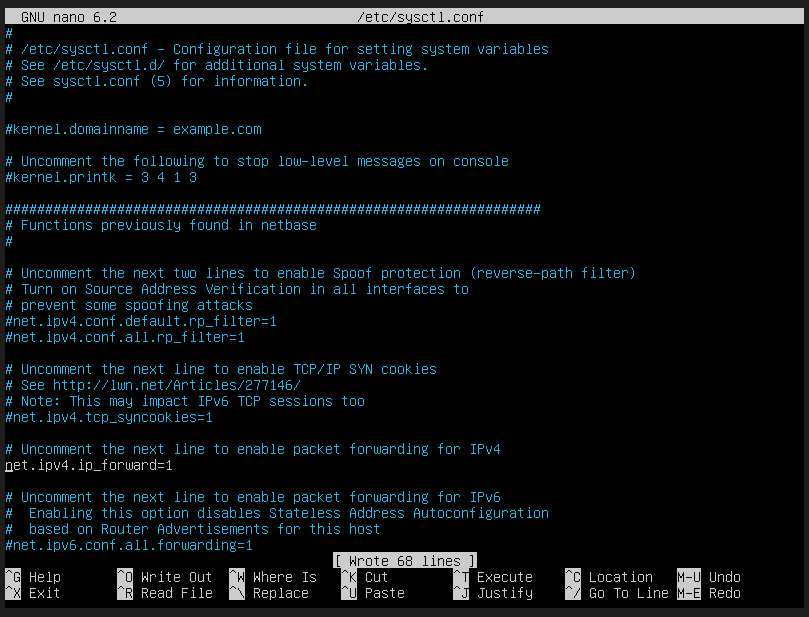

Применение:

```
sudo sysctl -p
```

### Запуск OpenVPN

```
sudo systemctl start openvpn@server
sudo systemctl enable openvpn@server
```

Проверка:

```
sudo systemctl status openvpn@server
```
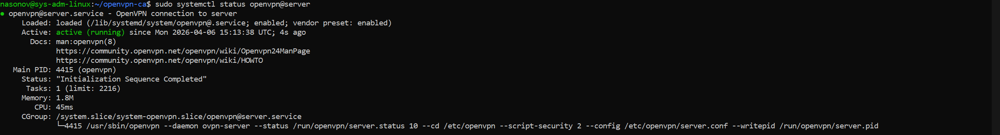
### Создание клиентского конфигурационного файла

```
nano client1.ovpn
```

Содержимое:

```
client
dev tun
proto udp

remote 172.23.0.7 1194

resolv-retry infinite
nobind

persist-key
persist-tun

ca /home/nasonov/openvpn-ca/pki/ca.crt
cert /home/nasonov/openvpn-ca/pki/issued/client1.crt
key /home/nasonov/openvpn-ca/pki/private/client1.key

remote-cert-tls server
data-ciphers AES-256-GCM:AES-128-GCM:AES-256-CBC
auth SHA256

verb 3
```
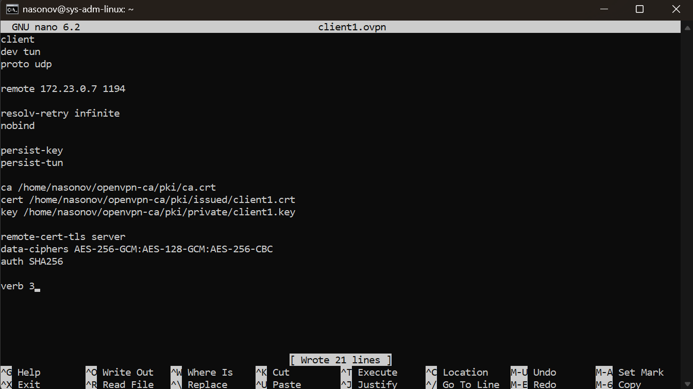

### Проверка подключения

```
sudo openvpn --config client1.ovpn
```

В результате получено сообщение:

```
Initialization Sequence Completed
```
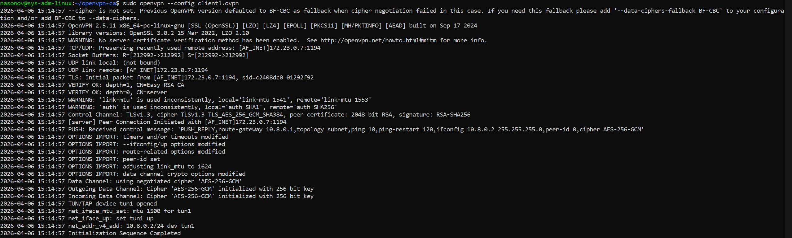

## Задание 20. Настройка Samba-сервера

Для организации общего доступа по протоколу SMB был установлен сервер Samba:

```
sudo apt install samba -y
```

### Создание общей директории

Была создана директория для общего доступа:

```
sudo mkdir -p /raid/0/share
sudo chmod 777 /raid/0/share
```

В директории был создан тестовый файл:

```
echo "Samba test OK" | sudo tee /raid/0/share/test.txt
```
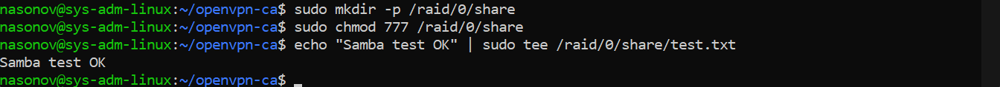

### Настройка конфигурации Samba

В файл `/etc/samba/smb.conf` был добавлен следующий раздел:

```
[share]
   path = /raid/0/share
   browseable = yes
   writable = yes
   guest ok = yes
   read only = no
```
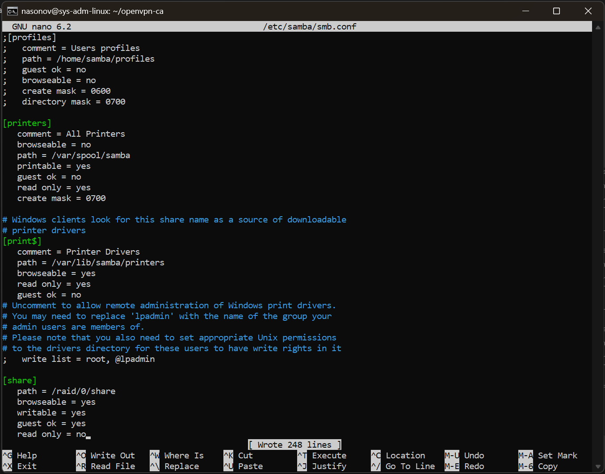

После внесения изменений служба была перезапущена:

```
sudo systemctl restart smbd
```

### Проверка доступа

Доступ к ресурсу был проверен с использованием клиента:

```
smbclient -L //172.23.0.7 -N
```
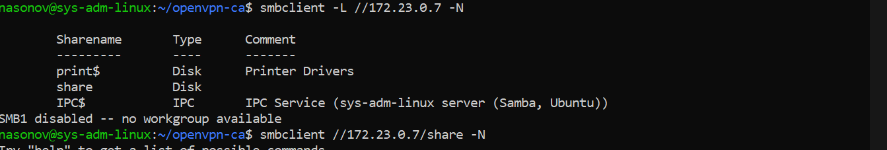

Также было выполнено подключение к ресурсу:

```
smbclient //172.23.0.7/share -N
```

В результате был получен доступ к общей директории и тестовому файлу `test.txt`.
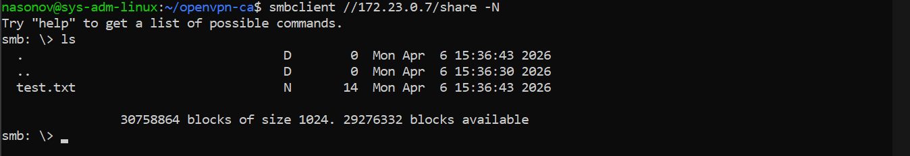

## Задание 21. Проброс портов в VPN-сеть

Для обеспечения доступа к сервисам в VPN-сети был настроен проброс портов с использованием `iptables`.

### Включение маршрутизации

В файле `/etc/sysctl.conf` была включена маршрутизация:

```bash
net.ipv4.ip_forward=1
```

Применение настроек:

```
sudo sysctl -p
```
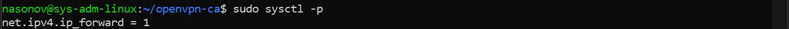

### Настройка проброса портов

Были настроены правила DNAT для перенаправления трафика с портов 139 и 445 на VPN-клиент:

```
sudo iptables -t nat -A PREROUTING -i enp0s3 -p tcp --dport 139 -j DNAT --to-destination 10.8.0.2:139
sudo iptables -t nat -A PREROUTING -i enp0s3 -p tcp --dport 445 -j DNAT --to-destination 10.8.0.2:445
```

### Разрешение форвардинга

```
sudo iptables -A FORWARD -p tcp -d 10.8.0.2 --dport 139 -j ACCEPT
sudo iptables -A FORWARD -p tcp -d 10.8.0.2 --dport 445 -j ACCEPT
```

### Настройка NAT

```
sudo iptables -t nat -A POSTROUTING -o tun0 -j MASQUERADE
```

### Проверка

Проверка доступности портов была выполнена с использованием утилиты `nc`:

```
nc -zv 192.168.0.150 139
nc -zv 192.168.0.150 445
```

В результате доступ к сервисам через проброшенные порты был успешно установлен.
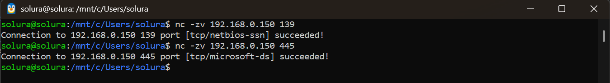

# Выводы

В ходе выполнения лабораторной работы были получены практические навыки администрирования Linux-систем и настройки сетевой инфраструктуры.

Были выполнены следующие задачи:

* развернута и настроена виртуальная машина;
* настроен SSH-доступ по ключу с отключением парольной аутентификации;
* сконфигурирована сеть с использованием netplan и статического IP-адреса;
* создан RAID-массив уровня 5 и настроен менеджер логических томов LVM;
* организовано постоянное монтирование файловой системы;
* настроен доступ по NFS и реализовано резервное копирование с использованием cron;
* выполнена настройка межсетевого экрана (iptables, ufw);
* реализован мониторинг сети и анализ трафика;
* настроен VPN-сервер OpenVPN и проверено подключение клиента;
* настроен Samba-сервер и обеспечен доступ к общим ресурсам;
* выполнена проверка доступности сервисов и портов из внешней сети.

В процессе выполнения работы возникли следующие трудности:

* проблемы с доступом по SSH после изменения настроек аутентификации и блокировки порта, что потребовало восстановления доступа через локальную консоль;
* некорректная работа `ssh-copy-id` в среде Windows, из-за чего ключ пришлось добавлять вручную;
* сброс настроек сети после перезагрузки из-за работы cloud-init;
* сложности с настройкой RAID-массива (переименование устройства md0 → md127 после перезагрузки);
* ошибки при настройке OpenVPN, связанные с несовпадением сертификата и ключа сервера;
* особенности сетевого взаимодействия между WSL, хостом и виртуальной машиной, из-за чего возникали проблемы при проверке доступности портов;
* трудности с пониманием маршрутизации и проброса портов между различными сетевыми интерфейсами;
* временные ошибки при настройке брандмауэра, приводившие к недоступности сервисов.

Все возникшие проблемы были проанализированы и устранены в процессе выполнения работы.

В результате лабораторной работы была развернута полноценная тестовая инфраструктура, включающая файловый сервер, VPN, средства резервного копирования и механизмы сетевой безопасности.