# Лабораторная работа №3

## KVM и Docker в среде WSL2

**Дисциплина:** Системное администрирование Linux  
**Студент:** Михаил Насонов  
**Группа:** *6413-10.05.03D*  
**Дата выполнения:** *18.04.26*  

---

# Цель работы

Освоить работу с гипервизором **KVM/libvirt**, создать и настроить гостевую виртуальную машину **Ubuntu Server**, подключить к ней дополнительный виртуальный диск, выполнить разметку и монтирование файловой системы, а также установить **Docker** и развернуть контейнер **nginx** со статической HTML‑страницей.

---

# Среда выполнения

В данной лабораторной работе роль **KVM‑хоста** выполняет дистрибутив **Ubuntu 22.04 в WSL2**.  
Это важно: в отчёте под «хостом» понимается именно **Linux‑хост внутри WSL2**, а не Windows.

| Компонент | Значение |
|---|---|
| Физическая/базовая ОС | Windows 11 |
| Среда Linux-хоста | WSL2 |
| Дистрибутив хоста | Ubuntu 22.04 |
| Версия WSL | 2.6.2.0 |
| Версия ядра WSL | 6.6.87.2-1 |
| Средство виртуализации | qemu-kvm + libvirt |
| Служба виртуализации | `libvirtd` |
| Сеть libvirt | `default` |
| Гостевая ВМ | Ubuntu Server |
| Имя гостевой ВМ | `ubuntu-lab3` |
| Пользователь в гостевой ВМ | `user` |

Для выполнения работы были использованы встроенные средства WSL2, KVM/libvirt и консольные утилиты администрирования.

---

# Ход выполнения работы

## Задание 1. Подготовка хостовой машины с KVM

На первом этапе была проверена пригодность Linux‑хоста в WSL2 для запуска KVM.  
Ключевая цель этапа — убедиться, что доступны:

- `systemd`;
- устройство `/dev/kvm`;
- ускорение KVM;
- служба `libvirtd`;
- инструменты `virsh`.

### Установка необходимых пакетов

На хосте WSL2 были установлены пакеты для KVM, libvirt и создания виртуальных машин:

```
sudo apt update
sudo apt install -y qemu-kvm libvirt-daemon-system libvirt-clients virtinst \
  cpu-checker bridge-utils cloud-image-utils openssh-client
```

### Проверка состояния среды

```
ps -p 1 -o comm=
systemctl is-system-running
ls -l /dev/kvm
egrep -c '(vmx|svm)' /proc/cpuinfo
kvm-ok
sudo systemctl status libvirtd --no-pager
sudo virsh version
sudo virsh list --all
sudo virsh net-list --all
sudo virsh pool-list --all
```

В ходе проверки было установлено следующее:

- процесс `PID 1` — это `systemd`;
- состояние системы — `running`;
- устройство `/dev/kvm` присутствует;
- команда `kvm-ok` подтвердила, что **KVM acceleration can be used**;
- служба `libvirtd` находится в состоянии **active (running)**;
- команда `virsh list --all` выполняется без ошибок;
- сеть `default` в libvirt активна и настроена на автозапуск;
- пул хранения образов по умолчанию отсутствовал и был создан отдельно.

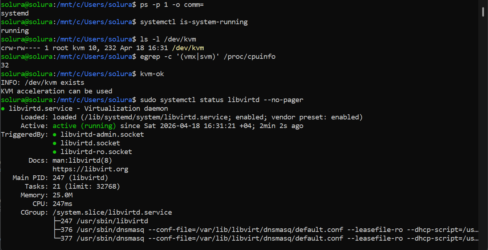
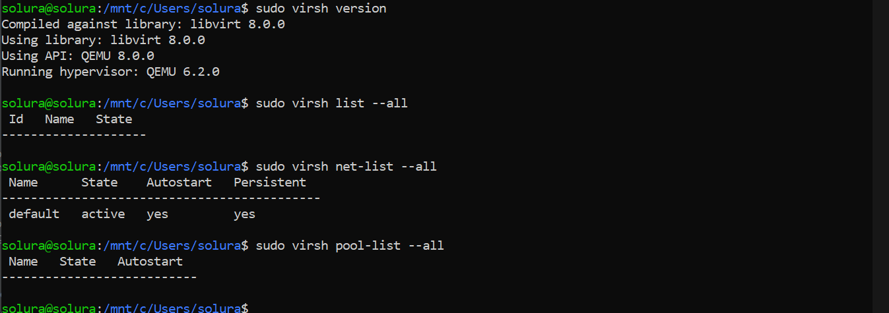

### Создание storage pool по умолчанию

Так как команда `virsh pool-list --all` изначально не показывала активного пула, был создан стандартный каталог хранения образов виртуальных машин:

```
sudo mkdir -p /var/lib/libvirt/images
sudo virsh pool-define-as default dir --target /var/lib/libvirt/images
sudo virsh pool-build default
sudo virsh pool-start default
sudo virsh pool-autostart default
sudo virsh pool-list --all
```

После выполнения этих команд появился активный пул `default`, который используется для хранения образов гостевой ВМ и дополнительных виртуальных дисков.
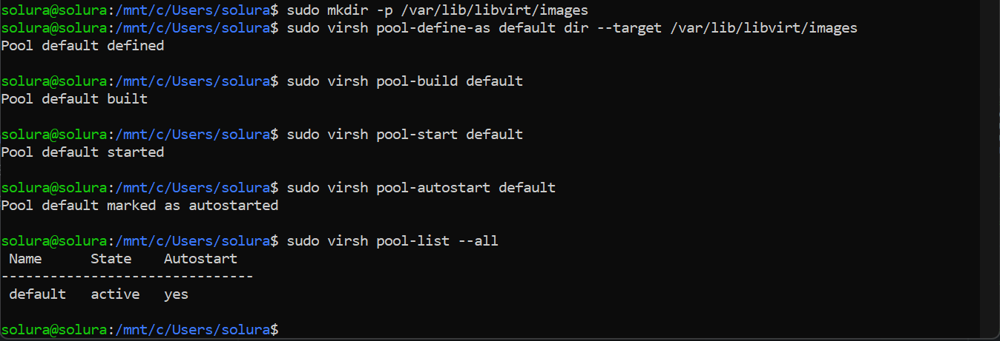

---

## Задание 2. Создание гостевой ВМ в KVM

Для создания гостевой ВМ в условиях WSL2 был использован **headless‑сценарий** через `virt-install` и **Ubuntu Server cloud image**.  
Такой способ удобен в консольной среде без графического интерфейса и полностью подходит для создания рабочей Ubuntu Server ВМ.

### Подготовка каталога виртуальной машины

```
VM_NAME=ubuntu-lab3
IMG_DIR=/var/lib/libvirt/images/$VM_NAME
BASE_IMG=$IMG_DIR/ubuntu-server.qcow2
SEED_IMG=$IMG_DIR/seed.iso

sudo mkdir -p "$IMG_DIR"
```

### Загрузка образа Ubuntu Server

```
cd /tmp
wget -O jammy-server-cloudimg-amd64.img \
  https://cloud-images.ubuntu.com/jammy/current/jammy-server-cloudimg-amd64.img
sudo cp jammy-server-cloudimg-amd64.img "$BASE_IMG"
sudo qemu-img resize "$BASE_IMG" 20G
```

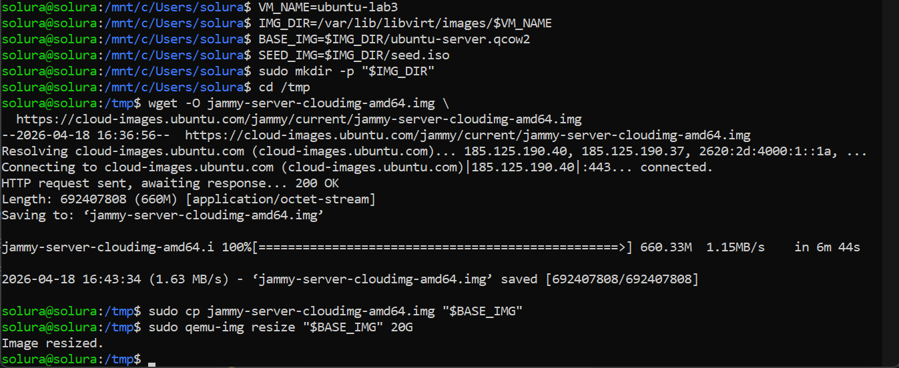

### Подготовка cloud-init для первичной настройки ВМ

Для автоматического создания пользователя `user` и задания начального пароля были созданы файлы `user-data` и `meta-data`.

```
cat > user-data <<'EOL'
#cloud-config
hostname: ubuntu-lab3
manage_etc_hosts: true
users:
  - default
  - name: user
    groups: sudo
    shell: /bin/bash
    sudo: ALL=(ALL) NOPASSWD:ALL
    lock_passwd: false
chpasswd:
  list: |
    user:User12345!
  expire: false
ssh_pwauth: true
package_update: true
packages:
  - qemu-guest-agent
EOL

cat > meta-data <<'EOL'
instance-id: ubuntu-lab3
local-hostname: ubuntu-lab3
EOL

cloud-localds seed.iso user-data meta-data
sudo mv seed.iso "$SEED_IMG"
rm -f user-data meta-data
```

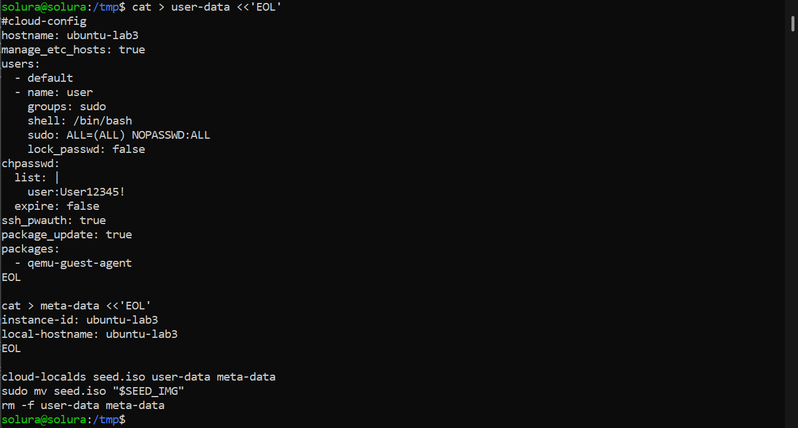

### Создание и импорт виртуальной машины

```
sudo virt-install \
  --name "$VM_NAME" \
  --memory 2048 \
  --vcpus 2 \
  --import \
  --os-variant ubuntu22.04 \
  --disk path="$BASE_IMG",format=qcow2,bus=virtio \
  --disk path="$SEED_IMG",device=cdrom \
  --network network=default,model=virtio \
  --graphics none \
  --console pty,target_type=serial \
  --noautoconsole
```
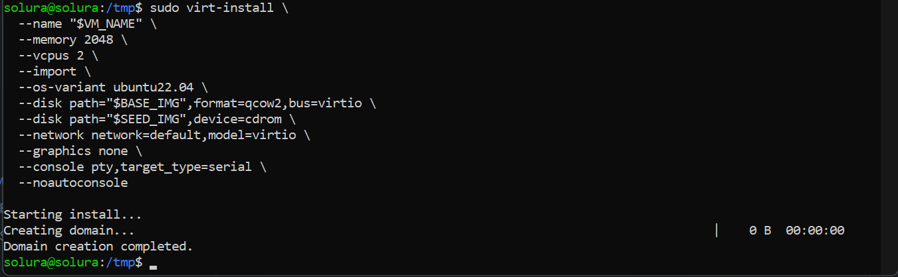

### Проверка запуска ВМ

```
sudo virsh list --all
sudo virsh start "$VM_NAME"
sudo virsh console "$VM_NAME"
```
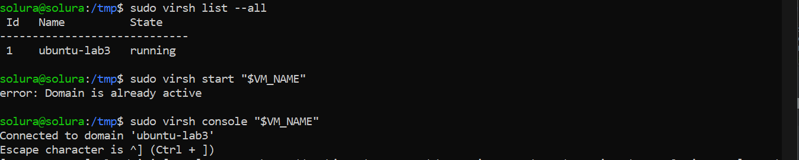
После подключения к консоли виртуальной машины можно войти в систему под пользователем:

```text
login: user
password: User12345!
```

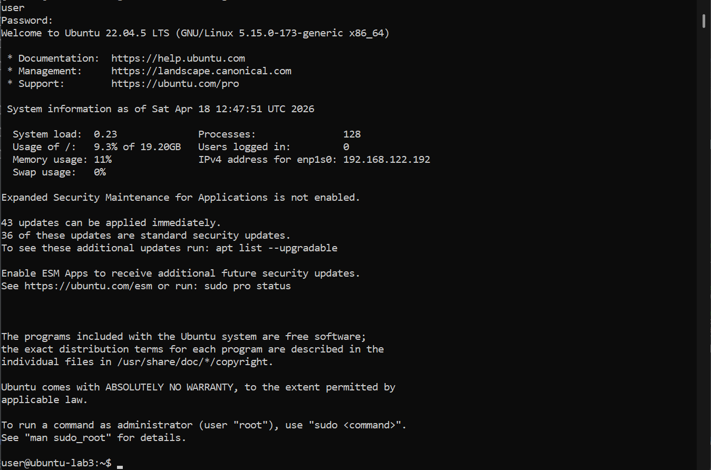

Для выхода из консоли `virsh` используется сочетание:

```text
Ctrl + ]
```

### Определение IP-адреса гостевой ВМ

```
ip a
```

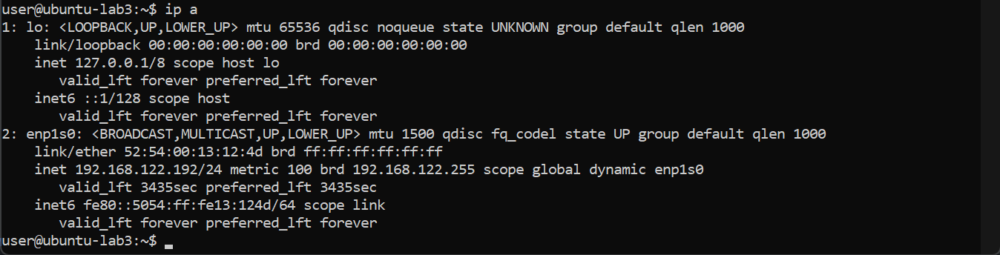

---

## Задание 3. Создание пользователя `user` в гостевой ВМ

Пользователь `user` был создан автоматически на этапе развёртывания ВМ при помощи `cloud-init`.  
После загрузки системы была выполнена проверка существования пользователя и возможности входа в систему.

### Проверка пользователя в гостевой ВМ

```
id user
getent passwd user
whoami
```

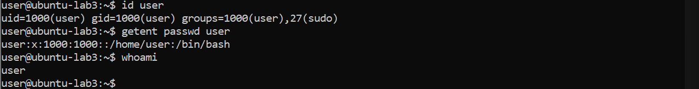
---

## Задание 4. Настройка SSH по ключу для пользователя `user`

На этом этапе в гостевой ВМ был установлен и настроен **OpenSSH Server**, затем выполнен переход от аутентификации по паролю к входу по ключу.

### Установка и запуск OpenSSH-сервера в гостевой ВМ

```
sudo apt update
sudo apt install -y openssh-server
sudo systemctl enable --now ssh
sudo systemctl status ssh --no-pager
```

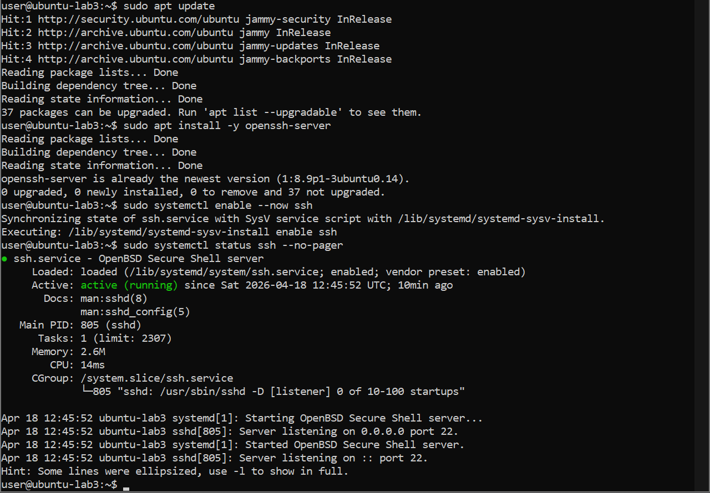

### Генерация SSH-ключа на хосте WSL2

На Linux-хосте создаётся пара ключей:

```
ssh-keygen -t ed25519
```

В результате создаются файлы:

- `~/.ssh/id_ed25519` — приватный ключ;
- `~/.ssh/id_ed25519.pub` — публичный ключ.

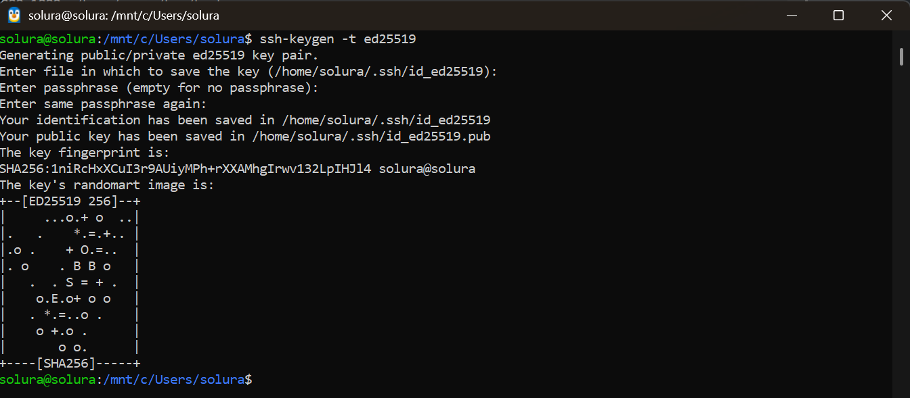

### Копирование публичного ключа в гостевую ВМ

```
ssh-copy-id user@192.168.122.192
```

После этого выполняется проверочное подключение:

```
ssh user@192.168.122.192
```

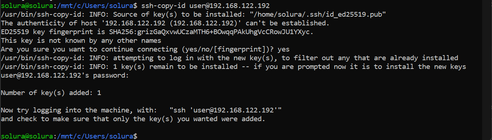

### Отключение парольной аутентификации в гостевой ВМ

На гостевой ВМ редактируется файл конфигурации SSH:

```
sudo nano /etc/ssh/sshd_config
```

Нужно убедиться, что в файле присутствуют следующие параметры:

```text
PubkeyAuthentication yes
PasswordAuthentication no
KbdInteractiveAuthentication no
PermitRootLogin no
```

После изменения конфигурации требуется перезапустить SSH-службу:

```
sudo systemctl restart ssh
```

### Повторная проверка входа

С хоста WSL2 повторно выполняется вход по SSH:

```
ssh user@192.168.122.192
```

Пароль больше не запрашивается, а вход происходит по ключу, значит настройка выполнена корректно.

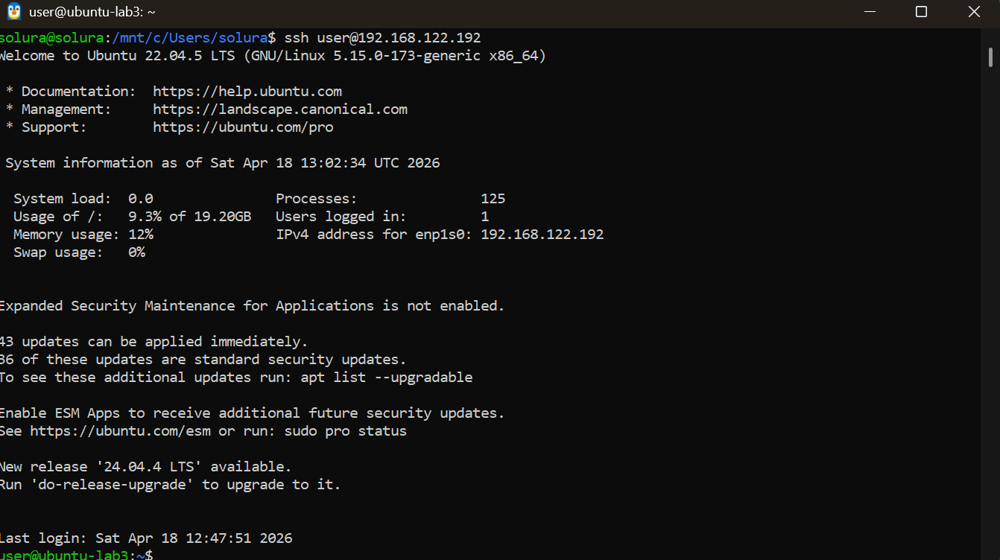
---

## Задание 5. Изучение конфигурации гостевой ВМ

Для анализа аппаратной и сетевой конфигурации гостевой системы были использованы стандартные Linux-команды.

### Команды для анализа конфигурации

```
lscpu
free -h
lsblk
df -h
ip a
ip r
```
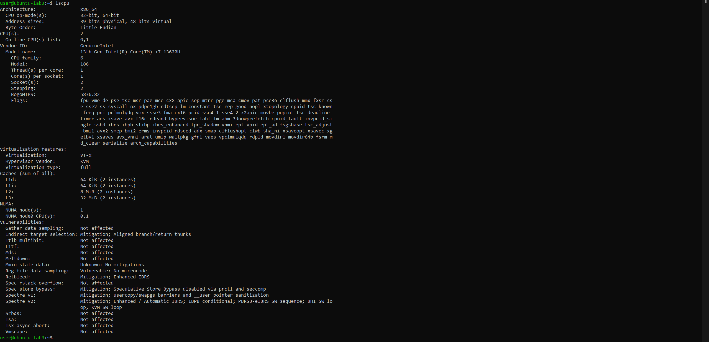
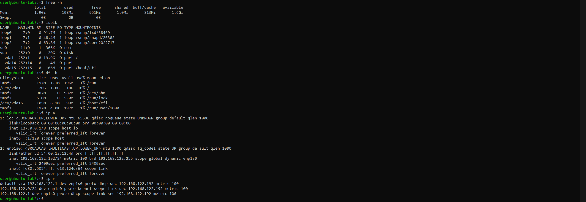
---

## Задание 6. Проброс дополнительного диска в гостевую ВМ через KVM

На хостовой системе WSL с использованием KVM был создан дополнительный виртуальный диск объёмом **10 ГБ**, который затем был подключён к гостевой виртуальной машине в качестве отдельного устройства.

### Создание виртуального диска на хосте

Перед созданием диска была задана переменная с именем виртуальной машины:

```
VM_NAME=ubuntu-lab3
```

Для хранения образов виртуальных дисков был создан каталог:

```
sudo mkdir -p /var/lib/libvirt/images
```

После этого был задан путь к файлу виртуального диска:

```
DATA_IMG=/var/lib/libvirt/images/${VM_NAME}-data.qcow2
```

Проверка пути:

```
echo $DATA_IMG  
```

Создание виртуального диска формата **qcow2** объёмом 10 ГБ:

```
sudo qemu-img create -f qcow2 "$DATA_IMG" 10G
```

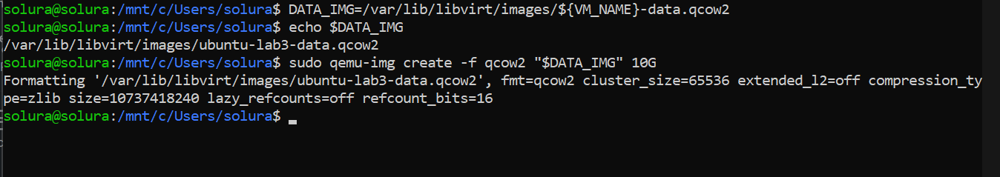

Это подтверждает успешное создание дополнительного виртуального диска.

### Подключение диска к гостевой ВМ

После создания диск был подключён к виртуальной машине с помощью команды:

```
sudo virsh attach-disk "$VM_NAME" "$DATA_IMG" vdb --persistent
```

где:

- `"$VM_NAME"` — имя виртуальной машины;
- `"$DATA_IMG"` — путь к созданному диску;
- `vdb` — имя устройства внутри гостевой системы;
- `--persistent` — делает подключение постоянным.

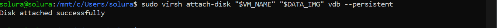

### Проверка в гостевой системе

После подключения диска был выполнен вход в гостевую систему и выполнена команда:

```
lsblk
```

В результате в системе появился новый диск:

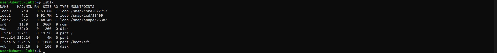

Это подтверждает успешное подключение дополнительного диска к виртуальной машине.

## Задание 7. Создание GPT-разметки, раздела и файловой системы ext4

После подключения нового диска была выполнена его разметка, создан один раздел и файловая система **ext4**, затем настроено постоянное монтирование в каталог `/disk`.

### Разметка диска

На гостевой ВМ:

```
sudo parted /dev/vdb --script mklabel gpt
sudo parted /dev/vdb --script mkpart primary ext4 1MiB 100%
```

### Создание файловой системы

```
sudo mkfs.ext4 /dev/vdb1
```

### Создание точки монтирования

```
sudo mkdir -p /disk
```

### Получение UUID раздела

```
sudo blkid /dev/vdb1
```

Пример результата:

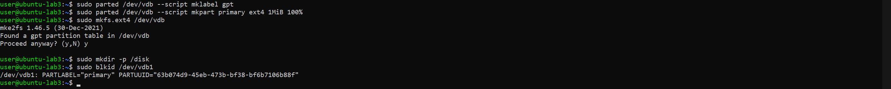

### Настройка автомонтирования

Открывается файл `/etc/fstab`:

```
sudo nano /etc/fstab
```

В него добавляется строка:

```text
UUID=31d70911-71bf-488f-9c4f-c40437710f7d /disk ext4 defaults 0 2
```

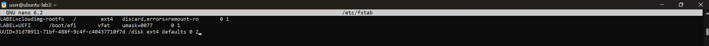

После сохранения выполняется проверка:

```
mount | grep /disk
```
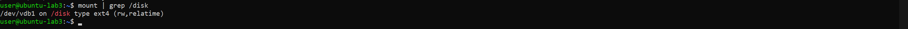

---

## Задание 8. Обеспечение доступности `/disk` пользователю `user`

Для того чтобы пользователь `user` мог работать с каталогом `/disk`, были изменены владелец и права доступа.

### Настройка прав

На гостевой ВМ:

```
sudo chown user:user /disk
sudo chmod 755 /disk
```

### Проверка под пользователем `user`

```
su - user
touch /disk/test_file
ls -l /disk
rm /disk/test_file
```

Успешное создание и удаление тестового файла подтверждает, что пользователь `user` имеет необходимые права на чтение и запись в каталоге `/disk`.

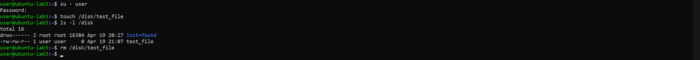

---

## Задание 9. Установка Docker в гостевой ВМ

На следующем этапе в гостевой ВМ был установлен Docker и выполнена проверка возможности запуска контейнеров от имени пользователя `user`.

### Установка Docker

На гостевой ВМ:

```
sudo apt update
sudo apt install -y docker.io
sudo systemctl enable --now docker
sudo systemctl status docker --no-pager
```

### Добавление пользователя `user` в группу `docker`

```
sudo usermod -aG docker user
```

После добавления пользователя в группу требуется завершить текущую сессию и войти заново, либо выполнить:

```
newgrp docker
```

### Проверка Docker

```
docker --version
docker run hello-world
```

Успешный запуск `hello-world` означает, что Docker установлен корректно, а пользователь `user` может запускать контейнеры без использования `sudo`.

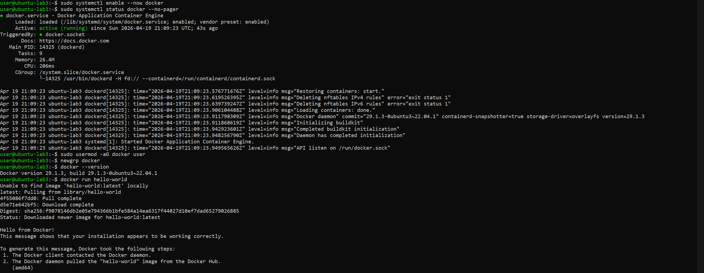

---

## Задание 10. Развёртывание контейнера nginx, выводящего фамилию студента

На смонтированном разделе `/disk` был создан каталог со статической HTML‑страницей, после чего запущен контейнер **nginx**, использующий данный каталог как корень сайта.

### Создание каталога сайта

На гостевой ВМ:

```
mkdir -p /disk/site
```

### Создание файла `index.html`

```
cat > /disk/site/index.html <<'EOL'
<!DOCTYPE html>
<html lang="ru">
<head>
    <meta charset="UTF-8">
    <title>Лабораторная работа №3</title>
</head>
<body>
    <h1>Насонов</h1>
    <p>Лабораторная работа №3: KVM и Docker</p>
</body>
</html>
EOL
```

### Запуск контейнера nginx

```
docker run -d \
  --name lab3-nginx \
  --restart unless-stopped \
  -p 80:80 \
  -v /disk/site:/usr/share/nginx/html:ro \
  nginx
```

### Проверка контейнера

```
docker ps
curl http://127.0.0.1/
```

### Проверка страницы с KVM-хоста

Так как в данной работе KVM-хостом является **Ubuntu в WSL2**, проверка с хоста выполняется именно оттуда:

```
curl http://192.168.122.192/
```

В HTML-странице должна корректно отображаться фамилия студента:

```
Насонов
```

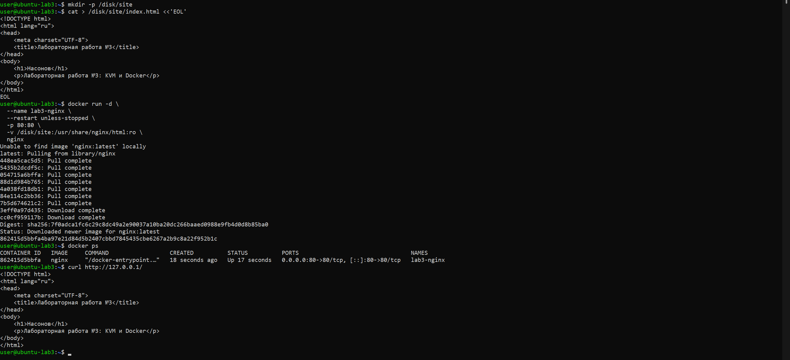
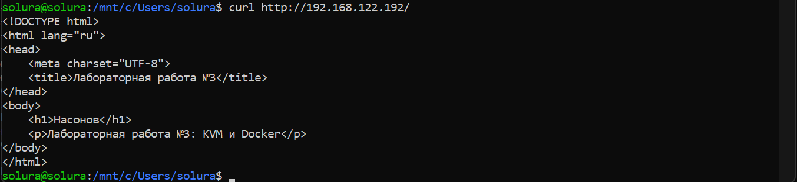
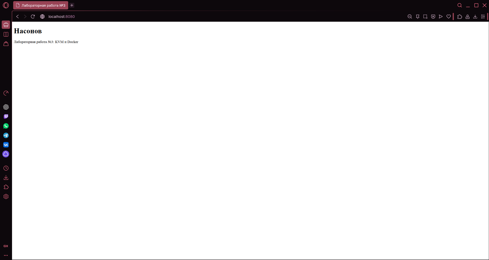
---

# Выводы

В ходе выполнения лабораторной работы был подготовлен Linux-хост в среде **WSL2** с поддержкой **KVM/libvirt**, создана и запущена гостевая виртуальная машина **Ubuntu Server**, настроен пользователь `user` и организован защищённый SSH-доступ по ключу.

Также была изучена конфигурация гостевой ВМ, создан и подключён дополнительный виртуальный диск, выполнена разметка в формате **GPT**, создана файловая система **ext4**, настроено постоянное монтирование раздела в каталог `/disk` через `/etc/fstab`, а также выданы права пользователю `user` для работы с этим каталогом.

На завершающем этапе в гостевой системе был установлен **Docker**, выполнена проверка запуска контейнеров и развернут контейнер **nginx**, использующий каталог на смонтированном разделе `/disk` в качестве корня сайта. Проверка с хоста подтвердила доступность веб-страницы по сети и корректное отображение фамилии студента.

Наиболее трудоёмким этапом работы стал **выбор среды выполнения лабораторной работы**. Первоначально рассматривалось использование **VirtualBox**, однако возникли проблемы с поддержкой **вложенной виртуализации (Nested Virtualization)**, что затруднило использование KVM внутри виртуальной машины. В связи с этим было принято решение использовать **WSL2**, что позволило обеспечить доступ к `/dev/kvm` и корректную работу виртуализации.

Дополнительные сложности возникли при **создании и подключении дополнительного виртуального диска**. В процессе настройки было выявлено, что в конфигурации виртуальной машины диск подключался с типом `raw`, несмотря на то что фактически создавался в формате **qcow2**. Это приводило к некорректному определению размера устройства (порядка нескольких килобайт вместо 10 ГБ) и невозможности дальнейшей разметки. Проблема была устранена путём корректировки конфигурации `libvirt` и установки правильного типа драйвера (`qcow2`).

Также определённое внимание потребовалось при настройке **SSH-доступа по ключу**, управлении правами доступа к каталогу `/disk` и добавлении пользователя в группу `docker`.

В результате выполнения лабораторной работы были получены практические навыки работы с виртуализацией **KVM**, администрированием **Ubuntu Server**, настройкой SSH, управлением дисками и файловыми системами, а также развёртыванием и использованием контейнеров **Docker**.
---

# Краткая шпаргалка по основным командам

## На хосте WSL2

```
sudo virsh list --all                 # список ВМ
sudo virsh start ubuntu-lab3          # запуск ВМ
sudo virsh shutdown ubuntu-lab3       # мягкое выключение ВМ
sudo virsh console ubuntu-lab3        # подключение к консоли ВМ
sudo virsh domifaddr ubuntu-lab3      # узнать IP ВМ
sudo virsh net-dhcp-leases default    # посмотреть DHCP-выдачу сети default
```

## В гостевой ВМ

```
lscpu                                 # информация о CPU
free -h                               # информация о RAM
lsblk                                 # список дисков и разделов
df -h                                 # использование файловых систем
ip a                                  # сетевые интерфейсы и IP
ip r                                  # маршруты
sudo systemctl status ssh             # состояние SSH
sudo systemctl status docker          # состояние Docker
```

## Docker

```
docker ps                             # запущенные контейнеры
docker logs lab3-nginx                # логи контейнера nginx
docker stop lab3-nginx                # остановка контейнера
docker rm lab3-nginx                  # удаление контейнера
```
