# Лабораторная работа №4

## DevOps-автоматизация: systemd, bash-скрипты и Ansible

**Дисциплина:** Системное администрирование Linux  
**Студент:** Михаил Насонов  
**Группа:** *6413-10.05.03D*

---

# Цель работы

Целью лабораторной работы является освоение практических подходов к автоматизации развёртывания и сопровождения серверных приложений в среде Linux с использованием инструментов DevOps.

В рамках работы выполняется построение полного цикла развёртывания сервиса:
- подготовка серверной среды на базе **Ubuntu Server**;
- настройка безопасного удалённого доступа по **SSH с использованием ключей**;
- реализация HTTP-сервиса на основе **bash-скрипта**;
- интеграция сервиса в систему инициализации **systemd** с поддержкой автозапуска и перезапуска;
- организация логирования и проверки доступности сервиса (healthcheck);
- автоматизация развёртывания с использованием **Ansible**;
- версионирование конфигурации и публикация в публичном **Git-репозитории**.

Таким образом, работа охватывает основные этапы DevOps-подхода: от ручной настройки сервиса до его полного автоматизированного развёртывания.

---

# Среда выполнения

В качестве среды выполнения использовалась отдельная виртуальная машина **Ubuntu Server**, развёрнутая в гипервизоре **VMware Workstation**.  

В отличие от предыдущей лабораторной работы, где использовалась среда **WSL2 + KVM/libvirt**, в данной работе используется изолированная серверная ВМ, выступающая в роли целевого хоста для автоматизации, что соответствует требованиям задания.

| Компонент | Значение |
|---|---|
| Базовая ОС | Windows 11 |
| Гипервизор | VMware Workstation 25H2 |
| Образ | Ubuntu Server 22.04.5 Live Server |
| Имя ВМ | `ubuntu-lab4` |
| Пользователь | `user` |
| Тип сети | Bridged |
| SSH-сервер | `openssh-server` |
| Система инициализации | `systemd` |
| Инструменты автоматизации | Bash, systemd, Ansible |
| Репозиторий конфигурации | Git (публичный remote) |

Использование режима сети **Bridged** позволило виртуальной машине получить собственный IP-адрес в локальной сети и обеспечить прямой доступ к сервису по HTTP и SSH без дополнительной настройки проброса портов.

Для выполнения работы применялись стандартные инструменты администрирования Linux и DevOps-практики:
- управление сервисами через `systemctl` и `journalctl`;
- проверка доступности через `curl`;
- работа с удалённым доступом через `ssh`;
- управление версиями через `git`;
- автоматизация конфигурации через `ansible`.

---

# Ход выполнения работы

## Задание 1. Подготовка виртуальной машины и пользователя

На первом этапе была развёрнута виртуальная машина **Ubuntu Server** в среде **VMware Workstation**. В процессе установки был создан пользователь `user`, включённый в группу `sudo`, а также установлен и активирован **OpenSSH Server**, обеспечивающий удалённый доступ к системе.

В рамках данной лабораторной работы используется подход, при котором один и тот же узел выполняет две роли:  
— целевого хоста (managed node);  
— управляющего узла (control node) для **Ansible**.  

Это позволяет упростить инфраструктуру и выполнить все этапы автоматизации в пределах одной виртуальной машины, сохраняя при этом корректную модель взаимодействия через SSH.

### Проверка базовой конфигурации системы

После установки была выполнена первичная проверка состояния системы:

```
hostnamectl
ip a
ip r
sudo systemctl status ssh --no-pager
```

В ходе проверки:

- подтверждено корректное имя хоста и версия системы;
- определён IP-адрес ВМ, используемый для SSH-подключений и Ansible-инвентаря;
- проверена таблица маршрутизации;
- подтверждено, что служба `ssh` находится в состоянии **active (running)**.

Таким образом, система готова к удалённому взаимодействию и дальнейшей автоматизации.

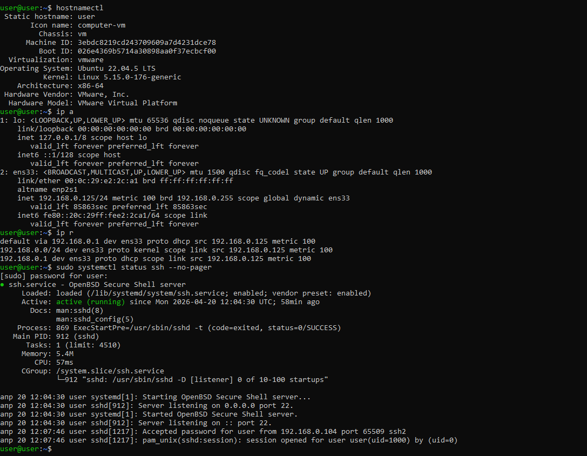

---

### Установка необходимых пакетов

В соответствии с требованиями задания были установлены базовые инструменты для администрирования и автоматизации:

```
sudo apt update
sudo apt install -y git curl python3 python3-venv ansible openssh-server
```

Назначение установленных пакетов:

- `git` — управление версиями конфигурации;
- `curl` — проверка HTTP-доступности сервиса;
- `python3`, `python3-venv` — среда выполнения и зависимости для Ansible;
- `ansible` — инструмент автоматизации;
- `openssh-server` — обеспечение удалённого доступа.

После установки выполнена проверка доступности инструментов:

```
git --version
curl --version
python3 --version
ansible --version
```

Это подтвердило корректную установку и готовность среды к работе.

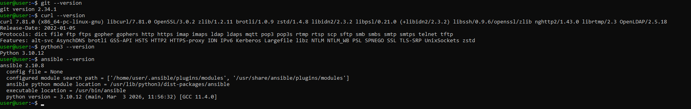


### Настройка SSH по ключу

Для обеспечения безопасного и автоматизированного доступа была настроена аутентификация по SSH-ключу.

Поскольку Ansible в данной работе запускается локально и подключается к той же ВМ по её IP-адресу, настройка ключей выполняется для пользователя `user` на этом же хосте.

Создание ключевой пары:

```
mkdir -p ~/.ssh
chmod 700 ~/.ssh
ssh-keygen -t ed25519 -f ~/.ssh/id_ed25519 -N ""
```

Добавление публичного ключа в список доверенных:

```
cat ~/.ssh/id_ed25519.pub >> ~/.ssh/authorized_keys
chmod 600 ~/.ssh/authorized_keys
```

Тестирование подключения:

```
ssh -o StrictHostKeyChecking=no user@<192.168.0.125>
```

Успешное подключение без запроса пароля подтверждает корректную настройку ключевой аутентификации, что является критически важным условием для работы Ansible.


### Усиление безопасности SSH

Для повышения безопасности может быть отключена аутентификация по паролю:

```
sudo nano /etc/ssh/sshd_config
```

Рекомендуемые параметры:

```
PubkeyAuthentication yes
PasswordAuthentication no
KbdInteractiveAuthentication no
PermitRootLogin no
```

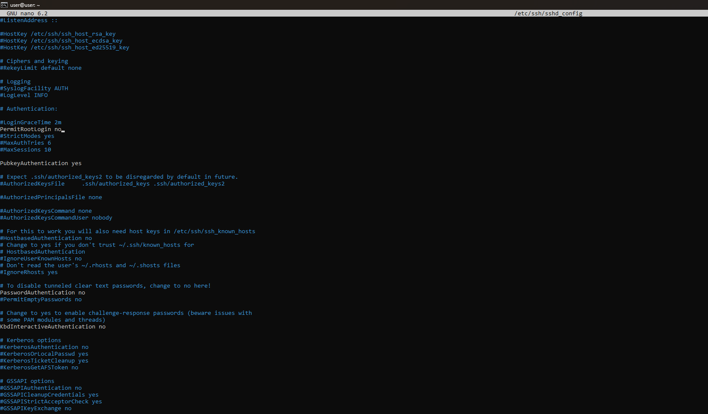

После внесения изменений служба SSH перезапускается:

```
sudo systemctl restart ssh
```

Это исключает возможность перебора паролей и оставляет единственный способ входа — по ключу.

## Задание 2. Создание bash-скрипта сервиса

На данном этапе был реализован минимальный HTTP-сервис, включающий статический контент и скрипт запуска.  
Структура сервиса размещена в каталоге `/opt/lab4-service`, что соответствует практике размещения прикладных сервисов вне пользовательских директорий.

### Подготовка каталога и HTML-страницы

```
sudo mkdir -p /opt/lab4-service/html

sudo tee /opt/lab4-service/html/index.html > /dev/null <<'EOF_HTML'
<!DOCTYPE html>
<html lang="ru">
<head>
    <meta charset="UTF-8">
    <title>Лабораторная работа №4</title>
</head>
<body>
    <h1>Насонов</h1>
    <p>Лабораторная работа №4: DevOps-автоматизация</p>
</body>
</html>
EOF_HTML
```

Файл `index.html` содержит статический контент и используется как корень веб-сервера. Наличие фамилии студента является обязательным требованием задания.

### Создание скрипта запуска сервиса

```
sudo tee /opt/lab4-service/service.sh > /dev/null <<'EOF_SERVICE'
#!/usr/bin/env bash
set -euo pipefail

exec python3 -m http.server 8000 --bind 0.0.0.0 --directory /opt/lab4-service/html
EOF_SERVICE
```

Назначение ключевых элементов:

- `set -euo pipefail` — обеспечивает корректное завершение скрипта при ошибках и предотвращает использование неинициализированных переменных;
- `exec` — заменяет текущий процесс оболочки процессом HTTP-сервера, что важно для корректной работы под управлением `systemd`;
- `python3 -m http.server` — встроенный HTTP-сервер Python, достаточный для демонстрационных задач;
- `--bind 0.0.0.0` — открывает доступ к сервису на всех сетевых интерфейсах;
- `--directory` — указывает каталог, используемый в качестве корня сайта.

### Настройка прав доступа

```
sudo chmod 755 /opt/lab4-service/service.sh
sudo chown -R www-data:www-data /opt/lab4-service/html
sudo chown root:root /opt/lab4-service/service.sh
```

Разделение прав реализовано следующим образом:

- каталог с веб-контентом передан пользователю `www-data`, под которым будет работать сервис;
- скрипт запуска принадлежит `root`, что предотвращает его изменение непривилегированными пользователями;
- права `755` позволяют выполнять скрипт и обеспечивают доступ к каталогу.

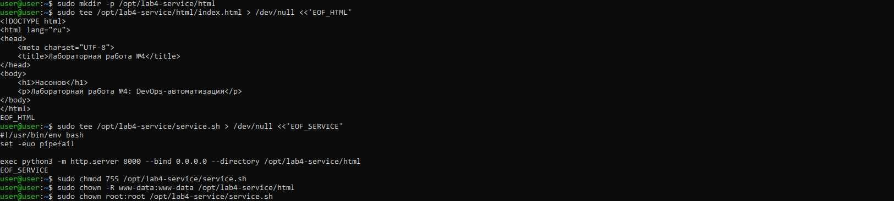

### Проверка работы сервиса

Для первичной проверки сервис был запущен вручную от имени пользователя `www-data`:

```
sudo -u www-data /opt/lab4-service/service.sh
```

После запуска в отдельном терминале выполнена проверка доступности:

```
curl http://192.168.0.125:8000/
```

Успешный ответ с HTML-страницей подтверждает:

- корректную работу скрипта;
- доступность сервиса по сетевому интерфейсу;
- правильную настройку прав доступа и структуры каталогов.

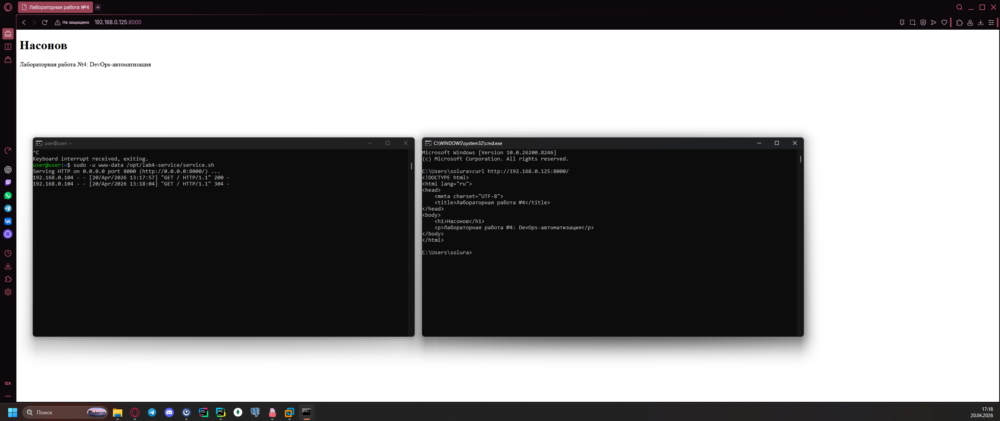

## Задание 3. Создание systemd-юнита

На данном этапе ранее подготовленный bash-скрипт был интегрирован в систему инициализации **systemd**. Это позволило перевести сервис в управляемое состояние: обеспечить автозапуск, единый интерфейс управления и автоматический перезапуск при сбоях.

---

### Создание unit-файла `lab4-service.service`

```
sudo tee /etc/systemd/system/lab4-service.service > /dev/null <<'EOF_UNIT'
[Unit]
Description=Lab 4 HTTP service
After=network-online.target
Wants=network-online.target

[Service]
Type=simple
User=www-data
Group=www-data
WorkingDirectory=/opt/lab4-service
ExecStart=/opt/lab4-service/service.sh
Restart=on-failure
RestartSec=3

[Install]
WantedBy=multi-user.target
EOF_UNIT
```

Ключевые параметры unit-файла:

- `User`/`Group` — запуск от имени системного пользователя `www-data`, что снижает риски по сравнению с `root`;
- `WorkingDirectory` — базовый каталог сервиса, в котором выполняется процесс;
- `ExecStart` — точка входа (bash-скрипт), инкапсулирующий логику запуска;
- `Restart=on-failure` и `RestartSec=3` — политика самовосстановления при аварийном завершении;
- `After`/`Wants=network-online.target` — запуск после полной инициализации сети;
- `WantedBy=multi-user.target` — подключение к стандартному уровню загрузки системы.

---

### Активация и проверка сервиса

После создания unit-файла была обновлена конфигурация `systemd`, включён автозапуск и выполнен старт сервиса:

```
sudo systemctl daemon-reload
sudo systemctl enable --now lab4-service
sudo systemctl status lab4-service --no-pager
```

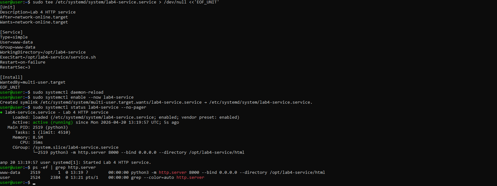

По результатам проверки:

- unit-файл корректно загружен (`loaded`);
- сервис находится в состоянии `active (running)`;
- автозапуск включён (`enabled`);
- процесс HTTP-сервера запущен под пользователем `www-data` и управляется через `systemd`.

Дополнительно была выполнена проверка доступности сервиса после запуска через `systemd`:

```
curl http://192.168.0.125:8000/
```

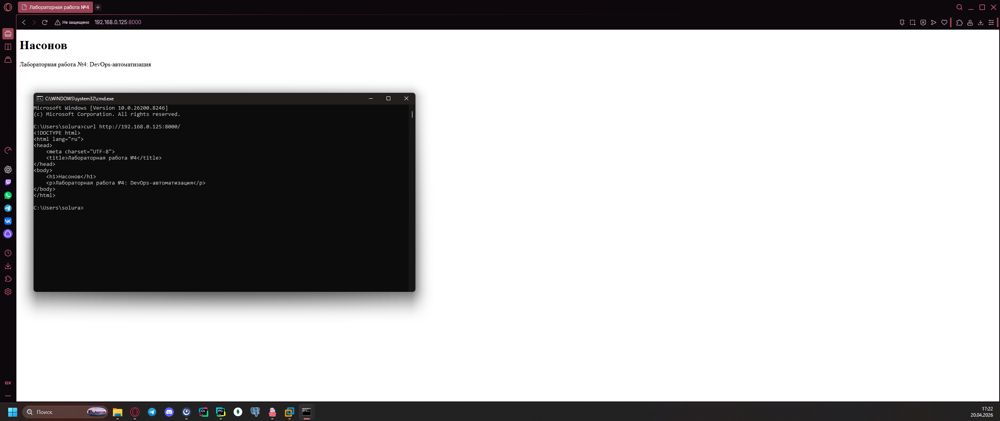

Успешный ответ подтверждает, что сервис корректно интегрирован в `systemd` и доступен по сетевому интерфейсу.

## Задание 4. Логирование и healthcheck

После перевода сервиса под управление `systemd` была выполнена проверка журналов и реализован отдельный healthcheck-скрипт, предназначенный для быстрой проверки доступности сервиса по HTTP.

### Просмотр логов через `journalctl`

Для анализа состояния сервиса и его поведения использовалась команда:

```
sudo journalctl -u lab4-service -n 20 --no-pager
```

Команда выводит последние записи журнала, относящиеся именно к unit’у `lab4-service`, что позволяет:

- проверить факт запуска и перезапуска сервиса;
- отследить сообщения, выводимые приложением в стандартные потоки;
- быстро диагностировать ошибки запуска или сетевой обработки запросов.

Поскольку сервис запускается под управлением `systemd`, его стандартный вывод и сообщения об ошибках автоматически попадают в journal, что упрощает централизованную диагностику без необходимости настраивать отдельные лог-файлы.


### Создание скрипта healthcheck

Для прикладной проверки доступности HTTP-сервиса был создан отдельный скрипт:

```
sudo tee /usr/local/bin/lab4-healthcheck.sh > /dev/null <<'EOF_HC'
#!/usr/bin/env bash
set -euo pipefail

URL="http://127.0.0.1:8000/"
HTTP_CODE="$(curl -o /dev/null -s -w '%{http_code}' "$URL" || true)"

if [[ "$HTTP_CODE" == "200" ]]; then
  echo "OK: service is available ($HTTP_CODE)"
  exit 0
else
  echo "FAIL: service is unavailable ($HTTP_CODE)"
  exit 1
fi
EOF_HC
```

После создания скрипту были выданы права на выполнение:

```
sudo chmod 755 /usr/local/bin/lab4-healthcheck.sh
```

Логика работы скрипта следующая:

- запрос отправляется на `http://127.0.0.1:8000/`, то есть на локальный интерфейс самой виртуальной машины;
- `curl` выполняет HTTP-запрос без вывода тела ответа;
- из ответа извлекается только HTTP-код;
- код `200` интерпретируется как признак корректной работы сервиса;
- любой иной результат рассматривается как отказ.

Использование `127.0.0.1` принципиально важно: такая проверка показывает, доступен ли сервис на самом сервере независимо от внешнего сетевого доступа и состояния маршрутизации.

### Проверка работы healthcheck-скрипта

Проверка при работающем сервисе:

```
/usr/local/bin/lab4-healthcheck.sh
echo $?
```

Ожидаемый результат:

```text
OK: service is available (200)
0
```

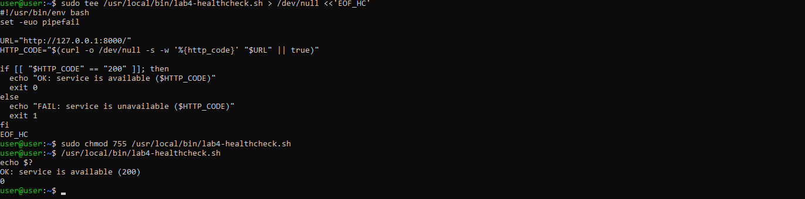

Код возврата `0` соответствует успешному состоянию и может использоваться в сценариях автоматизированного мониторинга.

Проверка при остановленном сервисе:

```
sudo systemctl stop lab4-service
/usr/local/bin/lab4-healthcheck.sh
echo $?
```

Ожидаемый результат:

```text
FAIL: service is unavailable (000)
1
```


Код `000` в данном случае означает, что HTTP-ответ не был получен вообще, то есть соединение с сервисом не установлено. Возврат `1` корректно сигнализирует об ошибке.


После завершения проверки сервис был повторно запущен:

```
sudo systemctl start lab4-service
/usr/local/bin/lab4-healthcheck.sh
```


Таким образом, реализованный healthcheck корректно различает два базовых состояния сервиса — доступность и недоступность — и может использоваться как для ручной диагностики, так и в автоматизированных сценариях контроля состояния.

## Задание 5. Создание Git-репозитория конфигурации

В рамках данного этапа все артефакты, связанные с развёртыванием сервиса, были структурированы и помещены в отдельный Git-репозиторий. Это обеспечивает воспроизводимость конфигурации и соответствует практике Infrastructure as Code.

### Формирование структуры проекта

```
mkdir -p ~/lab4-devops/{scripts,systemd,ansible}
```

Перенос подготовленных файлов:

```
cp /opt/lab4-service/service.sh ~/lab4-devops/scripts/
sudo cp /usr/local/bin/lab4-healthcheck.sh ~/lab4-devops/scripts/
sudo cp /etc/systemd/system/lab4-service.service ~/lab4-devops/systemd/
sudo chown -R user:user ~/lab4-devops
```

Структура проекта разделена по типам артефактов:
- `scripts` — исполняемые скрипты сервиса и healthcheck;
- `systemd` — unit-файл сервиса;
- `ansible` — материалы автоматизации.

### Настройка `.gitignore`

```
cat > ~/lab4-devops/.gitignore <<'EOF_GITIGNORE'
inventory.ini
*.retry
EOF_GITIGNORE
```

Файл `inventory.ini` исключён из репозитория, так как содержит параметры конкретной инфраструктуры (IP-адреса, пути к ключам). В репозиторий добавляется только шаблон.

### Создание `README.md`

```
cat > ~/lab4-devops/README.md <<'EOF_README'
# lab4-devops

Материалы лабораторной работы №4 по дисциплине «Системное администрирование Linux».

## Состав репозитория
- bash-скрипт HTTP-сервиса;
- systemd unit-файл;
- healthcheck-скрипт;
- Ansible inventory template;
- Ansible playbook развёртывания сервиса.
EOF_README
```

README фиксирует состав и назначение проекта, что важно для понимания структуры репозитория.

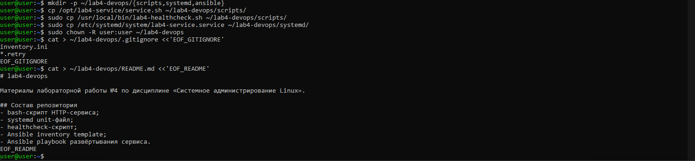

### Инициализация локального репозитория

```
cd ~/lab4-devops
git init
git config user.name "Михаил Насонов"
git config user.email "mnasonovy@gmail.com"
git add .
git commit -m "Initialize lab4 devops repository"
```

На данном этапе зафиксировано начальное состояние проекта.

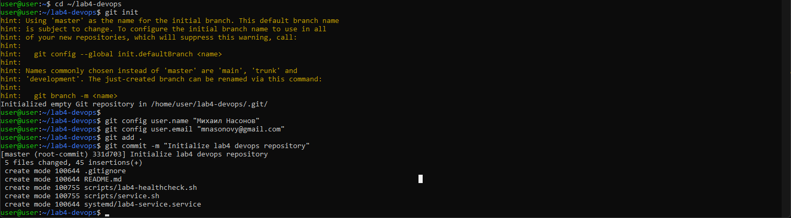

### Публикация в удалённый репозиторий

Для работы с GitHub была использована аутентификация по **SSH-ключам**, так как парольная аутентификация для операций `git push` не поддерживается.

Создание ключа:

```
ssh-keygen -t ed25519
```

Публичный ключ был добавлен в настройки GitHub (раздел **SSH Keys**).

Подключение удалённого репозитория и отправка данных:

```
git branch -M main
git remote add origin git@github.com:mnasonovy/lab4-devops.git
git push -u origin main
```

После выполнения команды репозиторий был успешно опубликован.

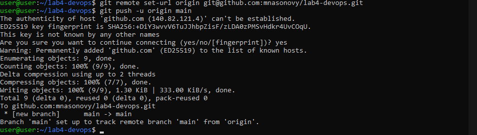

Использование SSH обеспечивает безопасную аутентификацию и соответствует современным DevOps-практикам.

### Проверка состояния репозитория

```
git status
git log --oneline
```

Результаты проверки:
- рабочее дерево находится в чистом состоянии (`working tree clean`);
- история коммитов отображается корректно;
- изменения зафиксированы и синхронизированы с удалённым репозиторием.


### Доступ к репозиторию

URL публичного репозитория:

```
https://github.com/mnasonovy/lab4-devops.git
```

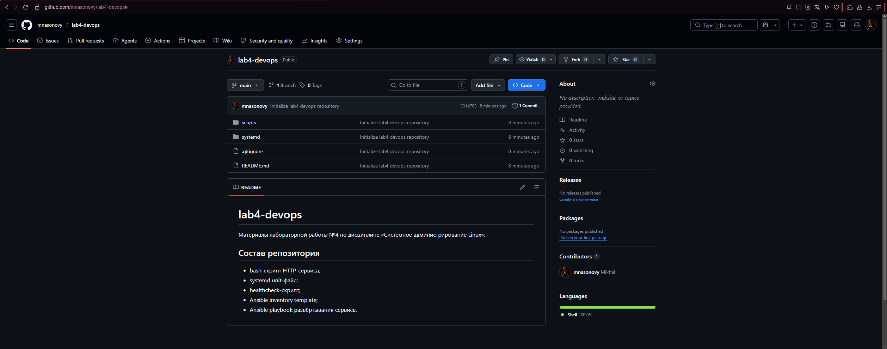

Таким образом, конфигурация сервиса была полностью вынесена в систему контроля версий, что обеспечивает её переносимость и воспроизводимость.

## Задание 6. Подготовка Ansible-инвентаря

После настройки SSH-доступа и публикации конфигурации в Git был подготовлен Ansible-инвентарь, описывающий целевой узел для автоматизации.

В данной работе используется модель, при которой Ansible запускается локально и управляет той же виртуальной машиной по её сетевому адресу через SSH.

### Рабочий `inventory.ini`

```
cat > ~/lab4-devops/ansible/inventory.ini <<'EOF_INV'
[lab4]
ubuntu-lab4 ansible_host=192.168.0.125 ansible_user=user ansible_ssh_private_key_file=/home/user/.ssh/id_ed25519 ansible_python_interpreter=/usr/bin/python3
EOF_INV
```

Назначение параметров:

- `ansible_host` — IP-адрес целевого узла;
- `ansible_user` — пользователь для подключения;
- `ansible_ssh_private_key_file` — путь к приватному SSH-ключу;
- `ansible_python_interpreter` — явное указание Python-интерпретатора на целевом узле (исключает проблемы совместимости).

### Шаблон инвентаря для репозитория

```
cat > ~/lab4-devops/ansible/inventory.example.ini <<'EOF_INV_EXAMPLE'
[lab4]
ubuntu-lab4 ansible_host=<IP_ADDRESS> ansible_user=user ansible_ssh_private_key_file=/home/user/.ssh/id_ed25519 ansible_python_interpreter=/usr/bin/python3
EOF_INV_EXAMPLE
```

В публичный репозиторий добавляется только шаблон `inventory.example.ini`.  
Реальный `inventory.ini` остаётся локально и исключается через `.gitignore`, так как содержит параметры конкретной среды.

### Проверка подключения с помощью Ansible

```
cd ~/lab4-devops/ansible
ansible -i inventory.ini lab4 -m ping
```

Ожидаемый результат:

```text
ubuntu-lab4 | SUCCESS => {
    "changed": false,
    "ping": "pong"
}
```

Успешное выполнение модуля `ping` подтверждает:

- корректную структуру инвентаря;
- работоспособность SSH-аутентификации по ключу;
- доступность узла для выполнения Ansible-задач.

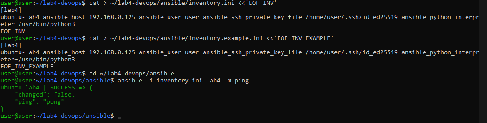

## Задание 7. Создание Ansible-playbook для развёртывания сервиса

На данном этапе был реализован Ansible playbook `site.yml`, автоматизирующий полный процесс развёртывания сервиса и приведения системы к заданному состоянию.

Playbook инкапсулирует основные этапы конфигурации:
- установку зависимостей;
- подготовку структуры каталогов;
- развёртывание статического контента;
- установку скрипта запуска;
- создание и регистрацию systemd-сервиса;
- управление состоянием сервиса.

Таким образом, ручные действия, выполненные на предыдущих этапах, были формализованы и перенесены в декларативное описание.

### Создание `site.yml`

```
cat > ~/lab4-devops/ansible/site.yml <<'EOF_PLAYBOOK'
---
- name: Deploy lab4 HTTP service
  hosts: lab4
  become: true
  vars:
    service_root: /opt/lab4-service
    service_port: 8000
    student_surname: "Насонов"

  tasks:
    - name: Install required packages
      apt:
        name:
          - python3
          - python3-venv
          - curl
        state: present
        update_cache: true
        cache_valid_time: 3600

    - name: Ensure service root exists
      file:
        path: "{{ service_root }}"
        state: directory
        owner: root
        group: root
        mode: '0755'

    - name: Ensure html directory exists
      file:
        path: "{{ service_root }}/html"
        state: directory
        owner: www-data
        group: www-data
        mode: '0755'

    - name: Deploy index.html
      copy:
        dest: "{{ service_root }}/html/index.html"
        owner: www-data
        group: www-data
        mode: '0644'
        content: |
          <!DOCTYPE html>
          <html lang="ru">
          <head>
              <meta charset="UTF-8">
              <title>Лабораторная работа №4</title>
          </head>
          <body>
              <h1>{{ student_surname }}</h1>
              <p>Лабораторная работа №4: DevOps-автоматизация</p>
          </body>
          </html>

    - name: Deploy service script
      copy:
        dest: "{{ service_root }}/service.sh"
        owner: root
        group: root
        mode: '0755'
        content: |
          #!/usr/bin/env bash
          set -euo pipefail
          exec python3 -m http.server {{ service_port }} --bind 0.0.0.0 --directory {{ service_root }}/html
      notify: restart lab4 service

    - name: Deploy systemd unit
      copy:
        dest: /etc/systemd/system/lab4-service.service
        owner: root
        group: root
        mode: '0644'
        content: |
          [Unit]
          Description=Lab 4 HTTP service
          After=network-online.target
          Wants=network-online.target

          [Service]
          Type=simple
          User=www-data
          Group=www-data
          WorkingDirectory={{ service_root }}
          ExecStart={{ service_root }}/service.sh
          Restart=on-failure
          RestartSec=3

          [Install]
          WantedBy=multi-user.target
      notify:
        - daemon reload
        - restart lab4 service

    - name: Enable and start lab4 service
      systemd:
        name: lab4-service
        enabled: true
        state: started

  handlers:
    - name: daemon reload
      systemd:
        daemon_reload: true

    - name: restart lab4 service
      systemd:
        name: lab4-service
        state: restarted
EOF_PLAYBOOK
```

Playbook использует декларативный подход: каждая задача описывает требуемое состояние системы, а не последовательность команд.

### Запуск playbook

```
cd ~/lab4-devops/ansible
ansible-playbook -i inventory.ini site.yml
```

При первом запуске возникла ошибка:

```
fatal: [ubuntu-lab4]: FAILED! => {"msg": "Missing sudo password"}
```

Причина ошибки — использование `become: true` без передачи пароля для `sudo`.

Для решения playbook был запущен с параметром:

```
ansible-playbook -i inventory.ini site.yml -K
```

Флаг `-K` (`--ask-become-pass`) позволяет передать пароль для выполнения привилегированных операций.

После ввода пароля playbook успешно выполнился:
- все задачи были применены;
- конфигурация системы приведена к требуемому состоянию;
- handlers выполнили перезапуск сервиса при изменениях.

Итог выполнения:

```
ok=9, changed=2, failed=0
```

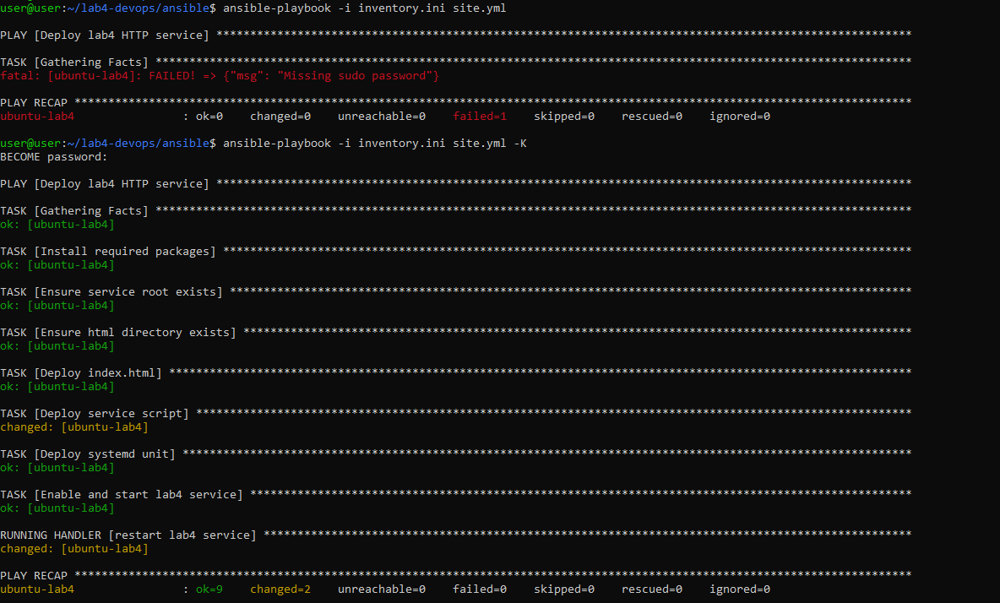

### Проверка идемпотентности

Для проверки корректности автоматизации playbook был выполнен повторно:

```
ansible-playbook -i inventory.ini site.yml -K
```

При повторном запуске задачи, не требующие изменений, переходят в состояние `ok`, а значение `changed` стремится к нулю.

Это подтверждает свойство **идемпотентности**: независимо от количества запусков система остаётся в заданном состоянии без побочных эффектов.

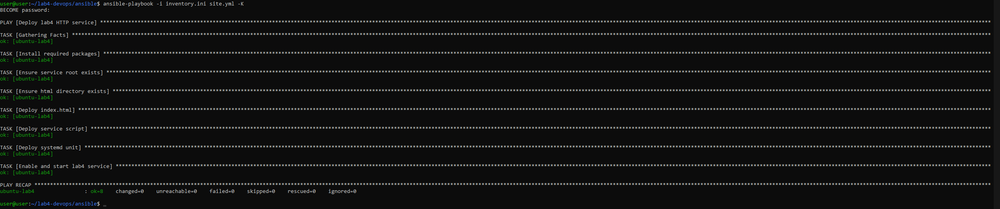

Таким образом, playbook обеспечивает воспроизводимое и предсказуемое развёртывание сервиса, что является ключевым принципом DevOps-практик.

## Задание 8. Добавление healthcheck через Ansible

На завершающем этапе playbook был расширен встроенной проверкой доступности сервиса с помощью Ansible-модуля `uri`.  
Это позволило перевести автоматизацию от простого развёртывания файлов к модели **deploy + verify**, при которой после применения конфигурации сразу выполняется контроль работоспособности сервиса.

### Добавление HTTP-проверки в `site.yml`

Перед блоком `handlers` в playbook были добавлены следующие задачи:

```
    - name: Check lab4 service over HTTP
      uri:
        url: "http://127.0.0.1:8000/"
        status_code: 200
        return_content: true
      register: lab4_http_check

    - name: Show healthcheck result
      debug:
        msg: "HTTP service is up. Response length={{ lab4_http_check.content | length }}"
```

Назначение добавленных задач:

- `uri` выполняет HTTP-запрос к сервису после его запуска;
- `status_code: 200` задаёт ожидаемый код ответа;
- `return_content: true` позволяет дополнительно получить тело ответа;
- `register` сохраняет результат проверки в переменную;
- `debug` выводит информацию о результате проверки.

Важно, что запрос направляется на `127.0.0.1:8000`, то есть на локальный интерфейс самой виртуальной машины.  
Поскольку задача выполняется на целевом хосте, это подтверждает доступность сервиса именно на сервере, независимо от внешнего сетевого доступа.

### Итоговая версия playbook

```yaml
---
- name: Deploy lab4 HTTP service
  hosts: lab4
  become: true
  vars:
    service_root: /opt/lab4-service
    service_port: 8000
    student_surname: "Насонов"

  tasks:
    - name: Install required packages
      apt:
        name:
          - python3
          - python3-venv
          - curl
        state: present
        update_cache: true
        cache_valid_time: 3600

    - name: Ensure service root exists
      file:
        path: "{{ service_root }}"
        state: directory
        owner: root
        group: root
        mode: '0755'

    - name: Ensure html directory exists
      file:
        path: "{{ service_root }}/html"
        state: directory
        owner: www-data
        group: www-data
        mode: '0755'

    - name: Deploy index.html
      copy:
        dest: "{{ service_root }}/html/index.html"
        owner: www-data
        group: www-data
        mode: '0644'
        content: |
          <!DOCTYPE html>
          <html lang="ru">
          <head>
              <meta charset="UTF-8">
              <title>Лабораторная работа №4</title>
          </head>
          <body>
              <h1>{{ student_surname }}</h1>
              <p>Лабораторная работа №4: DevOps-автоматизация</p>
          </body>
          </html>

    - name: Deploy service script
      copy:
        dest: "{{ service_root }}/service.sh"
        owner: root
        group: root
        mode: '0755'
        content: |
          #!/usr/bin/env bash
          set -euo pipefail
          exec python3 -m http.server {{ service_port }} --bind 0.0.0.0 --directory {{ service_root }}/html
      notify: restart lab4 service

    - name: Deploy systemd unit
      copy:
        dest: /etc/systemd/system/lab4-service.service
        owner: root
        group: root
        mode: '0644'
        content: |
          [Unit]
          Description=Lab 4 HTTP service
          After=network-online.target
          Wants=network-online.target

          [Service]
          Type=simple
          User=www-data
          Group=www-data
          WorkingDirectory={{ service_root }}
          ExecStart={{ service_root }}/service.sh
          Restart=on-failure
          RestartSec=3

          [Install]
          WantedBy=multi-user.target
      notify:
        - daemon reload
        - restart lab4 service

    - name: Enable and start lab4 service
      systemd:
        name: lab4-service
        enabled: true
        state: started

    - name: Check lab4 service over HTTP
      uri:
        url: "http://127.0.0.1:8000/"
        status_code: 200
        return_content: true
      register: lab4_http_check

    - name: Show healthcheck result
      debug:
        msg: "HTTP service is up. Response length={{ lab4_http_check.content | length }}"

  handlers:
    - name: daemon reload
      systemd:
        daemon_reload: true

    - name: restart lab4 service
      systemd:
        name: lab4-service
        state: restarted
```

### Финальный запуск playbook

```
ansible-playbook -i inventory.ini site.yml -K
```

Успешное выполнение задачи `uri` с HTTP-кодом `200` подтверждает, что сервис:
- корректно развернут;
- запущен после применения конфигурации;
- доступен на локальном интерфейсе виртуальной машины (`127.0.0.1:8000`).

Таким образом, playbook не только приводит систему к требуемому состоянию, но и сразу выполняет пост-проверку результата, что соответствует практикам надёжной автоматизации.

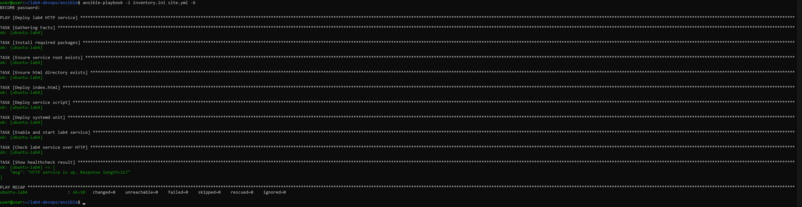

### Фиксация изменений в Git

После обновления playbook изменения были зафиксированы в репозитории и отправлены в удалённый origin:

```
cd ~/lab4-devops
git add .
git commit -m "Add ansible deployment and healthcheck"
git push
```

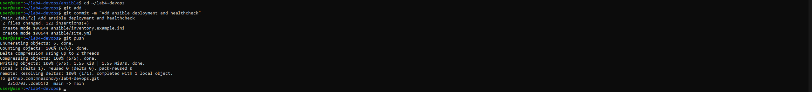

В результате финальная версия playbook, включая встроенный HTTP-healthcheck, была сохранена как в локальной истории изменений, так и в публичном репозитории.

# Выводы

В ходе выполнения лабораторной работы был реализован полный цикл развёртывания и автоматизации Linux-сервиса: от ручной настройки окружения до воспроизводимого деплоя с использованием Ansible.

На начальном этапе была развёрнута виртуальная машина **Ubuntu Server** в среде **VMware Workstation**, настроен пользователь с правами `sudo` и организован доступ по **SSH с использованием ключевой аутентификации**, что является базовым требованием для автоматизации.

Далее был реализован HTTP-сервис на основе **bash-скрипта** и встроенного сервера **Python**, после чего он был интегрирован в систему инициализации **systemd**. Это позволило перевести сервис в управляемое состояние, обеспечить его автозапуск, централизованное управление и автоматическое восстановление при сбоях.

На этапе диагностики были изучены механизмы журналирования через `journalctl`, а также реализован отдельный **healthcheck-скрипт**, позволяющий проверять доступность сервиса по HTTP-коду ответа. Дополнительно была реализована встроенная проверка в Ansible через модуль `uri`, что позволило выполнять верификацию сервиса сразу после развёртывания.

Все артефакты конфигурации были структурированы и помещены в **Git-репозиторий**, что обеспечило воспроизводимость и переносимость решения. Для публикации использовалась аутентификация по **SSH-ключам**, соответствующая современным требованиям безопасности.

Завершающим этапом стало построение **Ansible playbook**, который автоматически приводит систему к требуемому состоянию. Повторный запуск playbook подтвердил его **идемпотентность**, что является ключевым свойством корректной конфигурационной автоматизации.

## Практические сложности и особенности выполнения

В процессе выполнения лабораторной работы были выявлены реальные технические нюансы, оказывающие влияние на корректность работы системы:

- **Аутентификация в GitHub**  
  Попытка использовать пароль для `git push` привела к ошибке, так как GitHub больше не поддерживает парольную аутентификацию. Решением стало использование SSH-ключей, что является стандартом на практике.

- **Работа Ansible с `sudo`**  
  При первом запуске playbook возникла ошибка `Missing sudo password`, связанная с использованием `become: true`. Это потребовало запуска с флагом `-K` и понимания механизма повышения привилегий в Ansible.

- **Различие между localhost и IP ВМ**  
  При тестировании сервиса возникла путаница между `127.0.0.1` (локальный интерфейс хоста) и IP виртуальной машины. Это позволило лучше понять модель сетевого взаимодействия и различие между внутренней и внешней проверкой сервиса.

- **Права доступа при запуске от `www-data`**  
  Корректная работа сервиса требовала явной настройки владельцев и прав доступа к каталогам и скриптам. Без этого сервис не мог получить доступ к содержимому или корректно запуститься.

- **Поведение systemd и необходимость `daemon-reload`**  
  После изменения unit-файла изменения не применяются автоматически, что требует явного выполнения `systemctl daemon-reload`. Это важная особенность работы systemd.

- **Порт уже занят (port binding issue)**  
  При ручном запуске сервиса и последующем запуске через systemd возможно возникновение конфликта порта, что требует понимания процессов и их остановки.

## Итог

В результате выполнения лабораторной работы были получены не только базовые навыки работы с **bash**, **systemd**, **Git** и **Ansible**, но и практическое понимание:

- как переводить сервис из ручного режима в управляемый;
- как обеспечивать воспроизводимость конфигурации;
- как выявлять и устранять реальные проблемы автоматизации;
- как выстраивать процесс развёртывания с последующей проверкой результата.

Таким образом, лабораторная работа позволила сформировать целостное представление о подходах DevOps и принципах автоматизации серверной инфраструктуры.